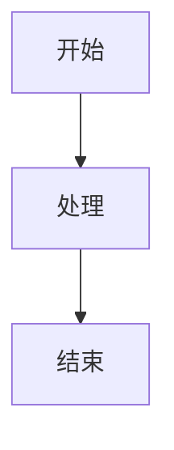

# 贡献指南

感谢你考虑为 Beacon Node 同步模块文档做出贡献！

## 🎯 贡献方式

### 1. 改进文档内容

#### 修正错误
- 技术错误
- 代码错误
- 错别字和语法错误

#### 补充内容
- 添加更多代码示例
- 增加流程图和架构图
- 补充实践案例
- 添加性能测试数据

#### 优化结构
- 改进章节组织
- 优化阅读体验
- 增强导航链接

### 2. 提出问题

如果你发现文档中的问题或有疑问：

1. 搜索现有的 [Issues](https://github.com/xueqianLu/beaconsync/issues)
2. 如果没有类似问题，创建新 Issue
3. 使用清晰的标题和描述
4. 提供必要的上下文信息

### 3. 提交 Pull Request

#### 准备工作

```bash
# 1. Fork 本仓库到你的账号

# 2. Clone 你的 fork
git clone https://github.com/YOUR_USERNAME/beaconsync.git
cd beaconsync

# 3. 添加上游仓库
git remote add upstream https://github.com/xueqianLu/beaconsync.git

# 4. 创建新分支
git checkout -b feature/your-feature-name
```

#### 进行修改

```bash
# 1. 进行你的修改

# 2. 测试修改（如果是代码示例）

# 3. 提交修改
git add .
git commit -m "描述你的修改"

# 4. 推送到你的 fork
git push origin feature/your-feature-name
```

#### 创建 Pull Request

1. 访问你的 fork 页面
2. 点击 "New Pull Request"
3. 填写 PR 描述：
   - 修改了什么
   - 为什么这么修改
   - 相关的 Issue 编号（如果有）

## 📝 编写规范

### 文档风格

#### Markdown 格式

```markdown
# 一级标题

## 二级标题

### 三级标题

- 列表项
- 列表项

1. 有序列表
2. 有序列表

**粗体** *斜体* `代码`

[链接文字](URL)
```

#### 代码块

使用语言标识符：

````markdown
```go
func example() {
    // Go代码
}
```

```bash
# Shell命令
echo "Hello"
```
````

#### 中英文混排

- 中英文之间加空格
- 中文和数字之间加空格
- 英文和数字之间不加空格

```
正确: 以太坊 2.0 使用 PoS 共识
错误: 以太坊2.0使用PoS共识
```

### 代码示例规范

#### 来源标注

```go
// 来自prysm/beacon-chain/sync/service.go
func (s *Service) Start() {
    // ...
}
```

#### 简化标注

```go
// 简化示例，完整代码见: path/to/file.go
func example() {
    // 核心逻辑
}
```

#### 注释说明

```go
func Process() {
    // 1. 第一步
    step1()
    
    // 2. 第二步
    step2()
    
    // 3. 第三步
    step3()
}
```

### 图表规范

#### ASCII 图表

```
┌─────────────┐
│   组件A     │
└──────┬──────┘
       │
       ↓
┌─────────────┐
│   组件B     │
└─────────────┘
```

#### Mermaid 图表

````markdown

````

## 🔍 提交前检查清单

- [ ] 代码示例可以运行（或标注为伪代码）
- [ ] 添加了必要的注释和说明
- [ ] 检查了拼写和语法
- [ ] 链接都是有效的
- [ ] 遵循了文档格式规范
- [ ] 更新了相关的目录和索引
- [ ] 测试了 Markdown 渲染效果

## 📚 参考资源

### 技术参考

- [Prysm文档](https://docs.prylabs.network/)
- [Ethereum Consensus Specs](https://github.com/ethereum/consensus-specs)
- [libp2p规范](https://github.com/libp2p/specs)

### 写作参考

- [中文文案排版指北](https://github.com/sparanoid/chinese-copywriting-guidelines)
- [Markdown Guide](https://www.markdownguide.org/)
- [GitHub Flavored Markdown](https://github.github.com/gfm/)

## 🎓 贡献等级

### 🌱 入门贡献者
- 修正错别字
- 修复链接
- 改进格式

### 🌿 活跃贡献者
- 补充代码示例
- 增加流程图
- 优化章节结构

### 🌳 核心贡献者
- 编写新章节
- 深度技术分析
- 重大改进提案

## 🏆 贡献者名单

感谢所有贡献者！你的名字将出现在 [CONTRIBUTORS.md](./CONTRIBUTORS.md)

## 📧 联系方式

有任何问题，欢迎通过以下方式联系：

- GitHub Issues
- Email: your-email@example.com

## 📄 许可证

贡献内容将采用与项目相同的 MIT 许可证。

---

再次感谢你的贡献！🎉
