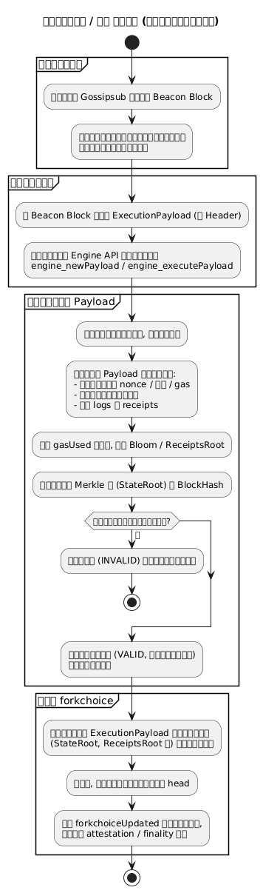
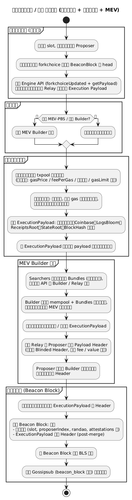

# 附录：业务 3 – 执行层交易 → 打包 → 执行

本页展示执行层交易从用户或 DApp 发起、进入执行客户端交易池，经本地或 MEV / PBS 路径打包为 ExecutionPayload，并最终在各节点执行的完整流程。

---

## 业务 3：执行层交易 → 打包 → 执行

### 主流程

子流程跳转：

- [交易提交路径](#b3-execution-submission)
- [交易打包（含 MEV / PBS）](#b3-execution-packing)
- [ExecutionPayload 执行流程](#b3-execution-execution)

### B3 Execution Submission（交易提交） {#b3-execution-submission}

### B3 Execution Packing（打包与 MEV） {#b3-execution-packing}

### B3 Execution Execution（执行） {#b3-execution-execution}

