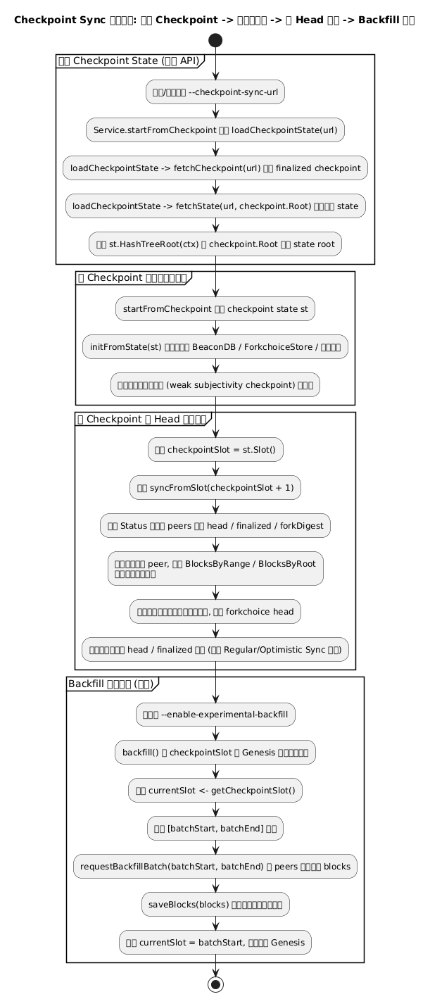
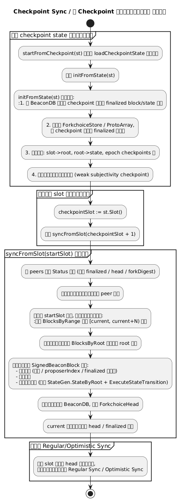
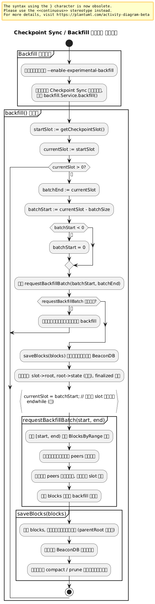

# 附录：业务 4 – Checkpoint Sync 与 Backfill

本页展示 Checkpoint Sync 从获取可信检查点 state、初始化本地链数据，到向前同步至 Head 并通过 Backfill 回填历史区块的完整流程。

---

## 业务 4：Checkpoint Sync 与 Backfill

### 主流程

子流程跳转：

- [Checkpoint State 获取流程](#b4-checkpoint-fetch-state)
- [从 Checkpoint 初始化并前向同步](#b4-checkpoint-init-and-forward)
- [Backfill 历史回填流程](#b4-checkpoint-backfill)

### B4 Checkpoint Fetch State（获取 Checkpoint State） {#b4-checkpoint-fetch-state}

### B4 Checkpoint Init & Forward Sync（初始化 + 向前同步） {#b4-checkpoint-init-and-forward}

### B4 Checkpoint Backfill（历史回填） {#b4-checkpoint-backfill}

