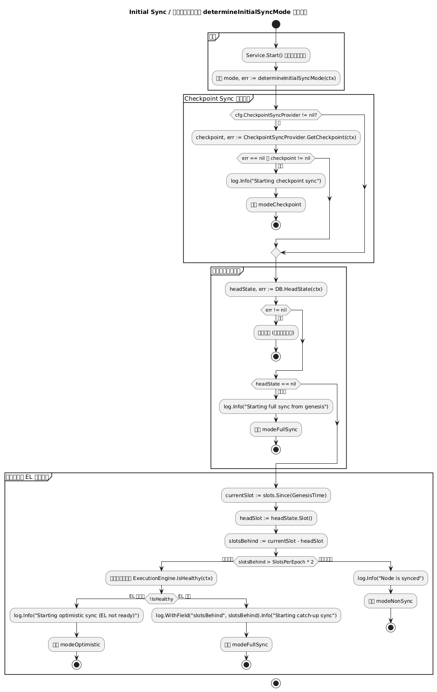
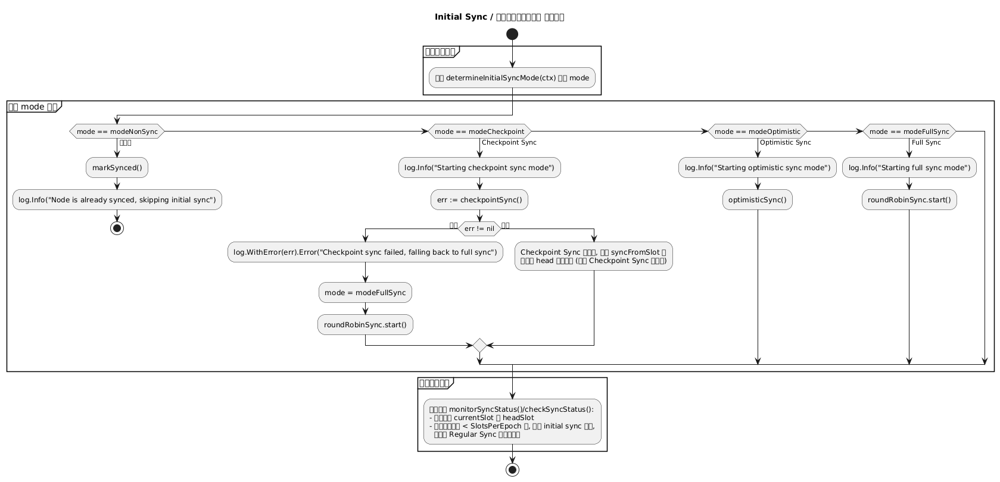

# 附录：同步相关流程图总览

本附录集中展示 Beacon 节点同步与消息处理的核心业务流程图，方便快速纵览：

- 业务 1：区块生成 → 广播 → 接收 → 验证与处理
- 业务 2：Attestation 生成 → 广播 → 接收 → 处理
- 业务 3：执行层交易提交 → 打包（含 MEV / PBS）→ 执行
- 业务 4：Checkpoint Sync + Backfill
- 业务 5：Aggregate & Proof 聚合流程
- 业务 6：Initial Sync 启动与模式选择
- 业务 7：Regular Sync 日常同步

> 说明：
>
> - 所有 `.puml` 文件位于 `img/` 目录，由 GitHub Actions 自动渲染为 `.png` 后在 Pages 中展示。
> - 各业务的主流程图也会嵌入到对应章节中，便于在阅读正文时对照理解。

---

## 业务 1：区块生成与处理（Block Pipeline）

### 主流程

子流程跳转：

- [区块生成流程](#b1-block-generation)
- [区块广播流程](#b1-block-broadcast)
- [区块接收流程](#b1-block-receive)
- [区块验证与处理流程](#b1-block-processing)

### B1 Block Generation（区块生成） {#b1-block-generation}

### B1 Block Broadcast（区块广播） {#b1-block-broadcast}

### B1 Block Receive（区块接收） {#b1-block-receive}

### B1 Block Processing（区块验证与处理） {#b1-block-processing}

---

## 业务 2：Attestation 生成与处理

### 主流程

子流程跳转：

- [Attestation 生成流程](#b2-attestation-generation)
- [Attestation 广播流程](#b2-attestation-broadcast)
- [Attestation 接收流程](#b2-attestation-receive)
- [Attestation 验证与处理流程](#b2-attestation-processing)

### B2 Attestation Generation（生成） {#b2-attestation-generation}

### B2 Attestation Broadcast（广播） {#b2-attestation-broadcast}

### B2 Attestation Receive（接收） {#b2-attestation-receive}

### B2 Attestation Processing（验证与处理） {#b2-attestation-processing}

---

## 业务 3：执行层交易 → 打包 → 执行

### 主流程

子流程跳转：

- [交易提交路径](#b3-execution-submission)
- [交易打包（含 MEV / PBS）](#b3-execution-packing)
- [ExecutionPayload 执行流程](#b3-execution-execution)

### B3 Execution Submission（交易提交） {#b3-execution-submission}

### B3 Execution Packing（打包与 MEV） {#b3-execution-packing}

### B3 Execution Execution（执行） {#b3-execution-execution}

---

## 业务 4：Checkpoint Sync 与 Backfill

### 主流程

子流程跳转：

- [Checkpoint State 获取流程](#b4-checkpoint-fetch-state)
- [从 Checkpoint 初始化并前向同步](#b4-checkpoint-init-and-forward)
- [Backfill 历史回填流程](#b4-checkpoint-backfill)

### B4 Checkpoint Fetch State（获取 Checkpoint State） {#b4-checkpoint-fetch-state}

### B4 Checkpoint Init & Forward Sync（初始化 + 向前同步） {#b4-checkpoint-init-and-forward}

### B4 Checkpoint Backfill（历史回填） {#b4-checkpoint-backfill}

---

## 业务 5：Aggregate & Proof 聚合投票

### 主流程

子流程跳转：

- [聚合者职责与选举](#b5-aggregate-duties)
- [本地聚合与构造 AggregateAndProof](#b5-aggregate-build-message)
- [Aggregate & Proof 广播](#b5-aggregate-broadcast)
- [Aggregate & Proof 接收与验证](#b5-aggregate-receive-validate)

### B5 Aggregate Duties & Selection（聚合者职责与选举） {#b5-aggregate-duties}

### B5 Aggregate Build Message（本地聚合与构造消息） {#b5-aggregate-build-message}

### B5 Aggregate Broadcast（广播） {#b5-aggregate-broadcast}

### B5 Aggregate Receive & Validate（接收与验证） {#b5-aggregate-receive-validate}

---

## 业务 6：Initial Sync 启动与模式选择

### 主流程

子流程跳转：

- [启动与前置条件检查](#b6-initial-bootstrap)
- [同步模式选择](#b6-initial-mode-selection)
- [按模式执行同步逻辑](#b6-initial-execute-mode)
- [Round-Robin Full Sync 细节](#b6-initial-round-robin)
- [切换到 Regular Sync](#b6-initial-transition-regular)

### B6 Initial Sync Bootstrap（启动与前置条件） {#b6-initial-bootstrap}

### B6 Initial Sync Mode Selection（模式选择） {#b6-initial-mode-selection}

### B6 Initial Sync Execute Mode（按模式执行） {#b6-initial-execute-mode}

### B6 Initial Sync Round-Robin（轮询 Full Sync） {#b6-initial-round-robin}

### B6 Initial Sync Transition to Regular（切换到 Regular Sync） {#b6-initial-transition-regular}

---

## 业务 7：Regular Sync 日常同步

### 主流程

> 更详细的 Regular Sync 行为说明参见：
>
> - 第 21 章 Regular Sync 概述
> - 第 22 章 Block Processing Pipeline
