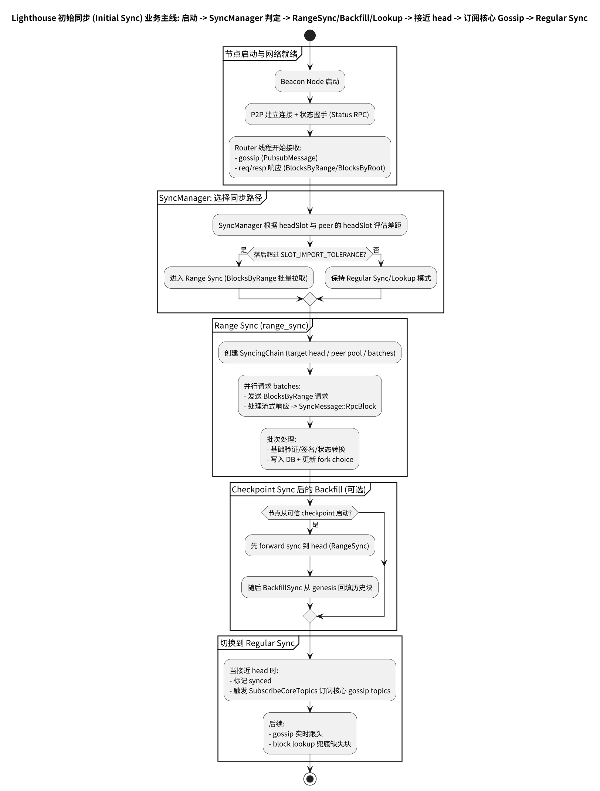

# 第 17 章: Lighthouse Initial Sync 概述 v8.0.1

Lighthouse 的同步（sync）主要由 `SyncManager` 负责，它围绕共识规范提供的两类 RPC：

- `BlocksByRange`：批量拉取（长距离/初始同步）
- `BlocksByRoot`：按 root 精确拉取（补父块、缺失块、attestation 指向未知 root）

此外，在 checkpoint sync 场景下还会接入 backfill（向 genesis 回填历史块）。

---

## 17.0 流程图

Initial Sync 的主线（SyncManager 判定 → RangeSync/Backfill/Lookup → 接近 head → 订阅核心 gossip → Regular Sync）：

源文件：

- ../../img/lighthouse/business6_initial_sync_flow.puml

更多分页图集（startup detection、peer connection、mode selection、batch sync、mode transition）见：

- [附录：业务 6（Initial Sync）流程图](./chapter_sync_flow_business6_initial.md)

---

## 17.1 SyncManager 的职责边界

`SyncManager` 的模块注释已经非常清晰地总结了两条主线：

- **Batch / Range Sync**：节点落后很多时，按 batch 拉取直到接近 head
- **Parent Lookup**：收到未知父块/未知 root 时，递归查找缺失链

定位：

- `beacon_node/network/src/sync/manager.rs`
  - https://github.com/sigp/lighthouse/blob/v8.0.1/beacon_node/network/src/sync/manager.rs

关键阈值：

- `SLOT_IMPORT_TOLERANCE = 32`：用于判断“我是否足够接近 head”
  - https://github.com/sigp/lighthouse/blob/v8.0.1/beacon_node/network/src/sync/manager.rs

---

## 17.2 Sync 模块结构

Sync 相关子模块位于：

- `beacon_node/network/src/sync/`
  - https://github.com/sigp/lighthouse/blob/v8.0.1/beacon_node/network/src/sync/mod.rs

典型子模块：

- `range_sync/`：按 epoch batch 拉取的长距离同步
- `backfill_sync/`：checkpoint sync 后回填历史块
- `block_lookups/`：缺失块/缺失父块的递归查找
- `network_context/`：对 RPC 请求生命周期（id、超时、归因）的集中管理

---

## 17.3 router → sync：事件入口

`Router` 会把 RPC 响应片段与错误转换成 `SyncMessage` 发送给 sync 服务：

- `on_blocks_by_range_response` → `SyncMessage::RpcBlock { ... }`
- `on_rpc_error` → `SyncMessage::RpcError { ... }`

定位：

- `beacon_node/network/src/router.rs`
  - https://github.com/sigp/lighthouse/blob/v8.0.1/beacon_node/network/src/router.rs

---

## 17.4 “同步完成”与 gossip 订阅

Lighthouse 在网络线程里用 `NetworkMessage::SubscribeCoreTopics` 控制是否订阅核心 gossip topics：

- `SubscribeCoreTopics`（注释：只有在 synced 或接近 head 时才订阅）
  - https://github.com/sigp/lighthouse/blob/v8.0.1/beacon_node/network/src/service.rs

这意味着：初始同步期间，节点可能不会订阅全部核心 gossip，避免被海量实时消息压垮。

---

## 17.5 与 Prysm/Teku 的对比

- 三者都有“Range/Batch 同步 + Missing Parent 查找”的组合。
- Lighthouse 通过 `SyncMessage` 把 router 与 sync 线程解耦，且 `network_context` 集中管理请求生命周期，是它在工程结构上的一个显著特征。
