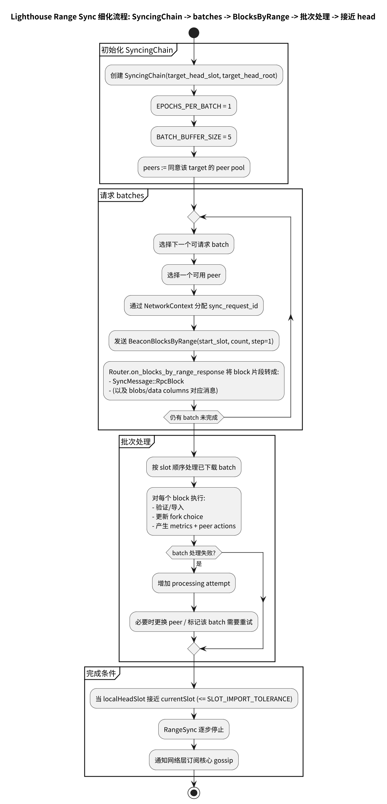

# 第 18 章: Lighthouse Full Sync（Range Sync）v8.0.1

Lighthouse 的 Full Sync 主要对应 `range_sync`：当节点落后较多时，通过 `BlocksByRange` 批量拉取并导入区块链，直到接近 peers 的 head。

---

## 18.0 流程图

Range Sync 细化流程（SyncingChain → batches → BlocksByRange → 批次处理 → 接近 head）：



源文件：

- ../../img/lighthouse/business6_initial_sync_range_sync.puml

建议配合附录分页图集阅读（把 range sync 放到 initial sync 的整体状态机中看）：

- [附录：业务 6（Initial Sync）流程图](./chapter_sync_flow_business6_initial.md)

---

## 18.1 range_sync 模块与核心结构

入口模块：

- `beacon_node/network/src/sync/range_sync/mod.rs`
  - https://github.com/sigp/lighthouse/blob/v8.0.1/beacon_node/network/src/sync/range_sync/mod.rs

核心结构：

- `SyncingChain`：表示一个需要下载的链段（包含 target head slot/root、batches、peer pool 等）
  - https://github.com/sigp/lighthouse/blob/v8.0.1/beacon_node/network/src/sync/range_sync/chain.rs

### 18.1.1 代码速览：SyncingChain 的关键字段（简化伪代码）

```rust
// beacon_node/network/src/sync/range_sync/chain.rs（简化示意）
struct SyncingChain {
    target_head_slot: Slot,
    target_head_root: Hash256,

    // 批次（通常按 epoch 切片）
    batches: Vec<Batch>,

    // 同意该 target head 的 peer 集合
    peers: HashSet<PeerId>,

    // “更靠近 head 的优先处理点”
    optimistic_start: Option<BatchId>,
}
```

---

## 18.2 Batch 粒度与重试策略

range sync 的关键参数：

- `EPOCHS_PER_BATCH = 1`
- `BATCH_BUFFER_SIZE = 5`
- `MAX_BATCH_DOWNLOAD_ATTEMPTS = 5`
- `MAX_BATCH_PROCESSING_ATTEMPTS = 3`

定位：

- `beacon_node/network/src/sync/range_sync/chain.rs`
  - https://github.com/sigp/lighthouse/blob/v8.0.1/beacon_node/network/src/sync/range_sync/chain.rs

文档建议强调：

- 下载失败与处理失败是不同维度的失败；处理失败（invalid batch）可能带来 peer penalty。

### 18.2.1 代码速览：batch 调度与重试（简化伪代码）

```rust
fn drive_range_sync(chain: &mut SyncingChain) {
  // 1) 先请求缺失的 batches（可能并行）
  for batch in chain.batches_to_download() {
    request_blocks_by_range(batch, choose_peer(&chain.peers));
  }

  // 2) 收到 blocks 后组装/校验 batch
  for batch in chain.ready_batches() {
    match process_batch(batch) {
      Ok(()) => chain.mark_processed(batch),
      Err(e) => chain.retry_or_penalize(batch, e),
    }
  }
}
```

---

## 18.3 peer pool：并行从多个 peer 拉取

`SyncingChain` 维护一组“同意 target head”的 peers（peer pool），并并行请求 batch：

- `SyncingChain { peers: HashSet<PeerId>, ... }`
  - https://github.com/sigp/lighthouse/blob/v8.0.1/beacon_node/network/src/sync/range_sync/chain.rs

这体现了 Lighthouse 的“机会主义并行”：只要有多个 peers 可用，就可以同时推进。

---

## 18.4 RPC 响应如何进入 sync

`BlocksByRange` 的流式响应在 router 转成 `SyncMessage::RpcBlock`：

- `Router::on_blocks_by_range_response` → `SyncMessage::RpcBlock`
  - https://github.com/sigp/lighthouse/blob/v8.0.1/beacon_node/network/src/router.rs

sync 层对请求 id/生命周期的集中管理在 `network_context`：

- `beacon_node/network/src/sync/network_context.rs`
  - https://github.com/sigp/lighthouse/blob/v8.0.1/beacon_node/network/src/sync/network_context.rs

---

## 18.5 与 Prysm/Teku 的对比

- Batch 同步的主逻辑三者高度一致：范围请求 + 分批导入 + 超时/重试。
- Lighthouse 的 `SyncingChain` 显式维护 peer pool 与 batch 状态图，更容易从代码上读出同步状态机。
