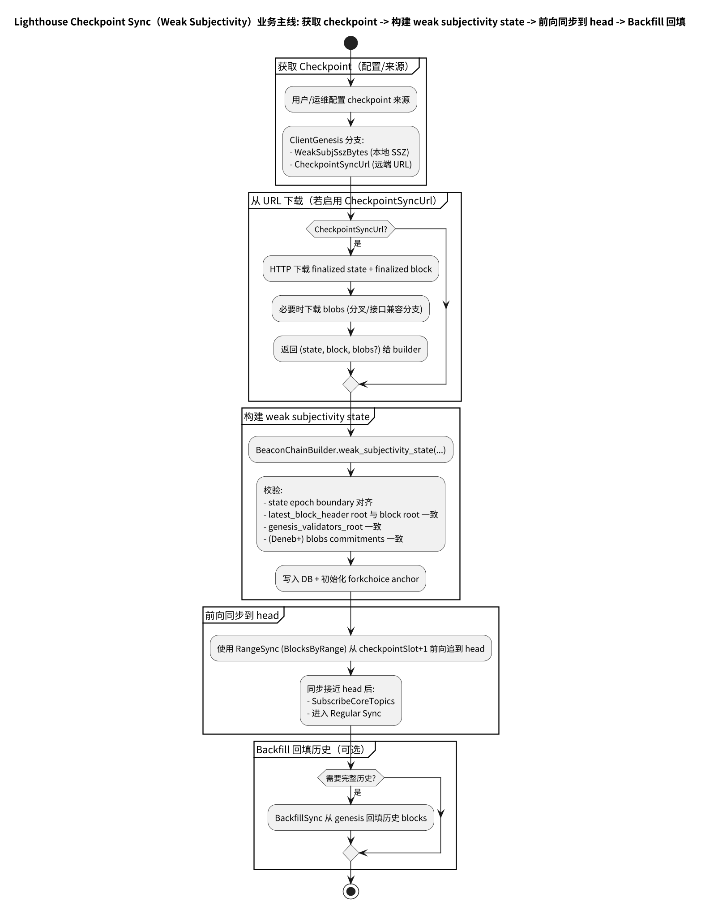
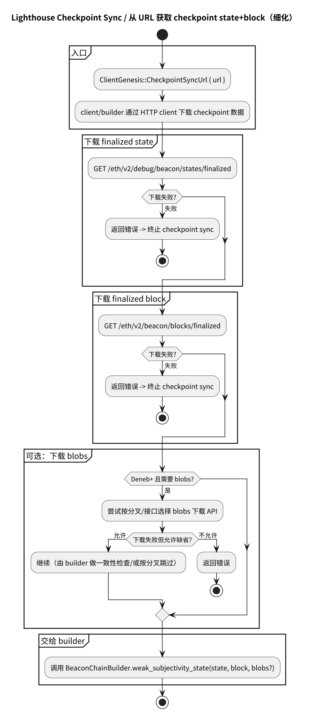
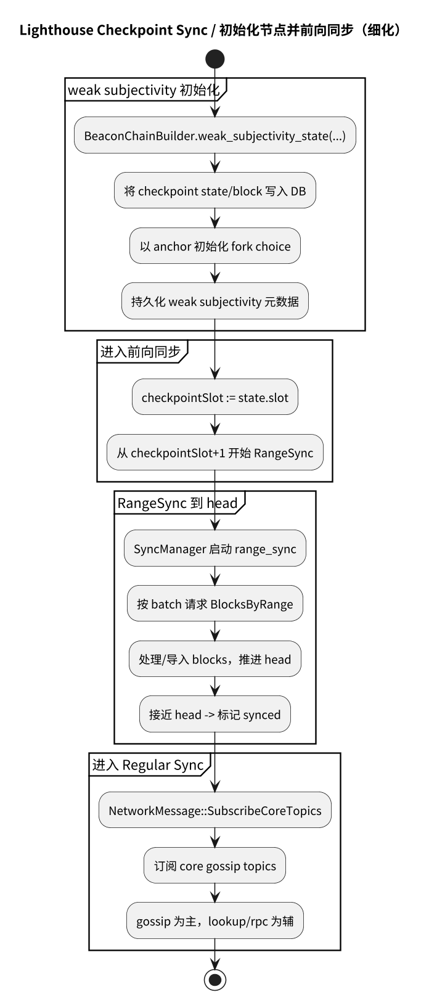
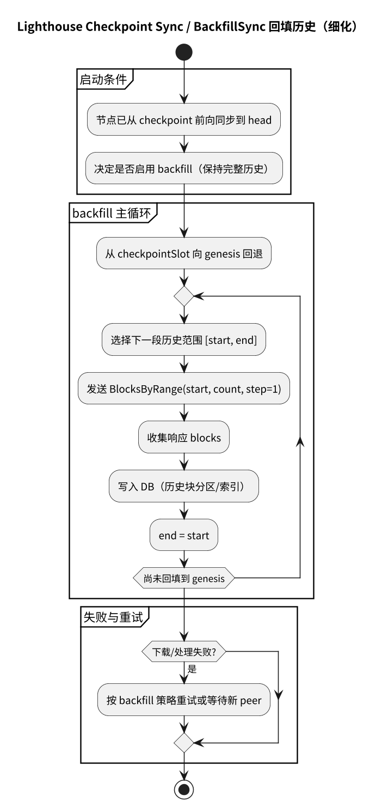

# 第 19 章: Lighthouse Checkpoint Sync（Weak Subjectivity）v8.0.1

Checkpoint Sync 的目标：从一个可信的“弱主观性（Weak Subjectivity）检查点”启动节点，让节点尽快具备服务能力，然后可选地回填到 genesis。

Lighthouse 在代码里常用术语：

- weak subjectivity state / checkpoint state

---

## 19.0 流程图

Checkpoint Sync 总览（获取 checkpoint → 构建 weak subjectivity state → 前向同步到 head → 可选 backfill）：

从 URL 获取 finalized state/block（细化）：

初始化节点并前向同步到 head（细化）：

Backfill 回填历史（细化）：

源文件：

- ../../img/lighthouse/business4_checkpoint_sync_flow.puml
- ../../img/lighthouse/business4_checkpoint_fetch_state.puml
- ../../img/lighthouse/business4_checkpoint_init_and_forward.puml
- ../../img/lighthouse/business4_checkpoint_backfill.puml

本主题的分页图集（checkpoint/backfill 主流程 + 子流程拆分）见：

- [附录：业务 4（Checkpoint/Backfill）流程图](./chapter_sync_flow_business4_checkpoint.md)

---

## 19.1 启动路径：ClientGenesis

Beacon node client 在构建链时，会根据启动配置选择 genesis 来源。其中 checkpoint sync 的关键分支有：

- `ClientGenesis::WeakSubjSszBytes { ... }`：从本地 SSZ bytes 加载 checkpoint
- `ClientGenesis::CheckpointSyncUrl { url }`：从远端 beacon node HTTP 下载 finalized state + block（以及可选 blobs）

定位：

- `beacon_node/client/src/builder.rs`
  - https://github.com/sigp/lighthouse/blob/v8.0.1/beacon_node/client/src/builder.rs

---

## 19.2 核心构建：BeaconChainBuilder::weak_subjectivity_state

将 checkpoint state/block 写入 DB，并以此构造 forkchoice anchor 的核心逻辑在：

- `BeaconChainBuilder::weak_subjectivity_state(...)`
  - https://github.com/sigp/lighthouse/blob/v8.0.1/beacon_node/beacon_chain/src/builder.rs

该函数里有几个文档值得强调的校验点：

1. **推进到 epoch boundary**：checkpoint state 如果不对齐 epoch，会进行 per-slot processing 推进到边界。
2. **state 最新块头与 checkpoint block root 一致性校验**。
3. **genesis_validators_root 校验**：避免错误网络（mainnet/testnet）混用。
4. **Deneb blobs 校验**（若提供 blobs）：commitment 数量/内容必须匹配 block。

---

## 19.3 Checkpoint 后的 backfill：可选回填到 genesis

Lighthouse 的 backfill 模块注释明确描述了 checkpoint sync 后的流程：

- 先从 checkpoint 做一次 RangeSync 到 head，使节点能立即服务
- 随后可选执行 backfill：从 genesis 回填历史块，保持完整历史

定位：

- `beacon_node/network/src/sync/backfill_sync/mod.rs`
  - https://github.com/sigp/lighthouse/blob/v8.0.1/beacon_node/network/src/sync/backfill_sync/mod.rs

---

## 19.4 与 Prysm/Teku 的对比

- 三者都支持“从可信 checkpoint 启动 + 再回填历史”。
- Lighthouse 在 builder 里显式做了较强的一致性校验（state/block/genesis root/blobs），使得“错误 checkpoint”更早失败，减少后续运行期风险。
