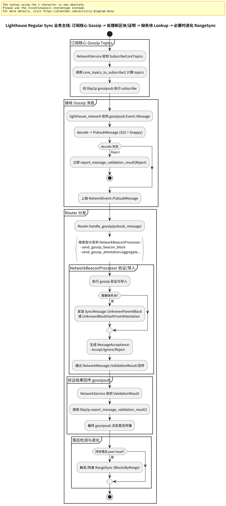

# 第 21 章: Lighthouse Regular Sync 概述 v8.0.1

Regular Sync 指节点已经接近 head 后的常态运行：

- 主要通过 gossip 跟踪新块与证明
- 通过 Missing Parent / Block Lookup 兜底补齐缺失块
- 必要时退化为 Range Sync（例如 parent chain 太长）

---

## 21.0 流程图

Regular Sync 主线（订阅核心 topics → gossip decode → router 分发 → processor 验证/导入 → 回传验证结果 → 必要时退化 RangeSync）：

源文件：

- ../../img/lighthouse/business7_regular_sync_flow.puml

更多分页图集（实时收块、周期性 head 检查、missing parent、catch-up、订阅管理、状态机更新）见：

- [附录：业务 7（Regular Sync）流程图](./chapter_sync_flow_business7_regular.md)

---

## 21.1 “接近 head”的判定：SLOT_IMPORT_TOLERANCE

SyncManager 使用 `SLOT_IMPORT_TOLERANCE` 判断是否需要进入长距离同步：

- `SLOT_IMPORT_TOLERANCE = 32`
  - https://github.com/sigp/lighthouse/blob/v8.0.1/beacon_node/network/src/sync/manager.rs

当 peers 的 head 超出这个容忍区间时，倾向触发 range sync。

---

## 21.2 Regular 期的核心：gossip + block lookup

gossip 入口仍然是 router 的 `handle_gossip`：

- https://github.com/sigp/lighthouse/blob/v8.0.1/beacon_node/network/src/router.rs

Missing Parent / Unknown root 的补齐由 SyncManager/BlockLookups 负责：

- `SyncManager`（注释：Parent Lookup）
  - https://github.com/sigp/lighthouse/blob/v8.0.1/beacon_node/network/src/sync/manager.rs
- `block_lookups` 模块总览注释
  - https://github.com/sigp/lighthouse/blob/v8.0.1/beacon_node/network/src/sync/block_lookups/mod.rs

---

## 21.3 Regular 期才订阅核心 gossip topics

网络线程的注释写得很明确：只有在 synced 或接近 head slot 时才订阅核心 topics：

- `NetworkMessage::SubscribeCoreTopics`
  - https://github.com/sigp/lighthouse/blob/v8.0.1/beacon_node/network/src/service.rs

并基于 fork digest 计算需要订阅的 topics：

- `core_topics_to_subscribe`
  - https://github.com/sigp/lighthouse/blob/v8.0.1/beacon_node/lighthouse_network/src/types/topics.rs

---

## 21.4 与 Prysm/Teku 的对比

- Regular sync 的结构三者一致：gossip 为主、rpc 为辅。
- Lighthouse 的“订阅核心 topics 的时机控制”在代码层更加显式（NetworkMessage::SubscribeCoreTopics）。
