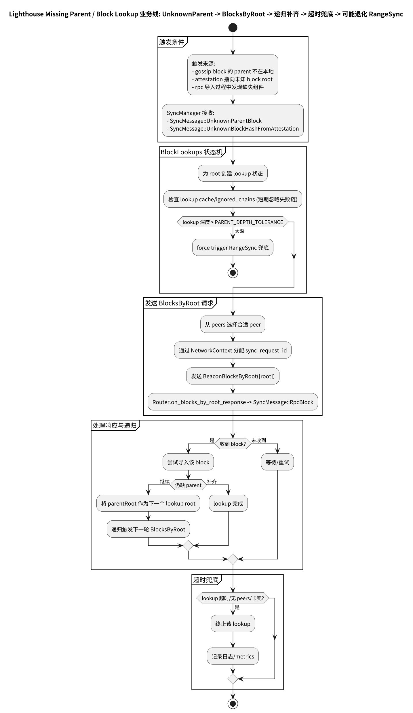

# 第 23 章: Lighthouse Missing Parent（Block Lookup）v8.0.1

Missing Parent 处理的典型触发：

- 收到一个区块，但其 parent 不在本地
- 收到 attestation 指向一个未知的 `beacon_block_root`

此时 Lighthouse 会进入 **Block Lookup Sync**：递归查找缺失 root 及其父链，并在必要时退化为 range sync。

---

## 23.0 流程图

Missing Parent / Block Lookup 业务线（UnknownParent/UnknownRoot → BlocksByRoot 递归补齐 → 深度/超时兜底 → 可能退化 RangeSync）：



源文件：

- ../../img/lighthouse/business7_block_lookup_missing_parent.puml

建议同时参考 Regular Sync 的分页图集（missing parent handling + catch-up 兜底）：

- [附录：业务 7（Regular Sync）流程图](./chapter_sync_flow_business7_regular.md)

---

## 23.1 block_lookups 模块：事件驱动状态机

模块总览注释明确写出：

- block lookup 是“事件驱动状态机”
- 预期的事件 API 若不匹配会导致 lookup stuck
- 有超时兜底，日志会提示 “Notify the devs a sync lookup is stuck”

定位：

- `beacon_node/network/src/sync/block_lookups/mod.rs`
  - https://github.com/sigp/lighthouse/blob/v8.0.1/beacon_node/network/src/sync/block_lookups/mod.rs

---

## 23.2 关键阈值：PARENT_DEPTH_TOLERANCE

block lookup 的最大搜索深度：

- `PARENT_DEPTH_TOLERANCE = SLOT_IMPORT_TOLERANCE`

定位：

- `beacon_node/network/src/sync/block_lookups/mod.rs`
  - https://github.com/sigp/lighthouse/blob/v8.0.1/beacon_node/network/src/sync/block_lookups/mod.rs

超过深度时会 **force trigger range sync**（避免在长 parent chain 上死磕）。

### 23.2.1 代码速览：lookup 深度兜底 + 退化 range sync（简化伪代码）

```rust
// beacon_node/network/src/sync/block_lookups/*（简化示意）
fn on_unknown_parent(child_root: Hash256) {
  let mut depth = 0;
  let mut current = child_root;

  while depth < PARENT_DEPTH_TOLERANCE {
    if db.contains_block(current) {
      break;
    }

    // 递归补齐：BlocksByRoot(current)
    request_blocks_by_root(current);
    current = parent_of(current)?; // 由响应驱动更新（事件驱动状态机）
    depth += 1;
  }

  if depth >= PARENT_DEPTH_TOLERANCE {
    // 长链兜底：避免 stuck
    force_trigger_range_sync();
  }
}
```

---

## 23.3 SyncManager：Missing Parent 与 Unknown Root 事件

SyncManager 接收多类触发：

- `UnknownParentBlock` / `UnknownBlockHashFromAttestation`

定位：

- `SyncMessage` enum
  - https://github.com/sigp/lighthouse/blob/v8.0.1/beacon_node/network/src/sync/manager.rs

---

## 23.4 与 Prysm/Teku 的对比

- 三者都会把 Missing Parent 视为“常态运行必备兜底”。
- Lighthouse 的 block lookup 在注释里把“事件安全（Lookup sync event safety）”作为显式约束写出来，提示实现者：如果改了事件流要非常小心。
