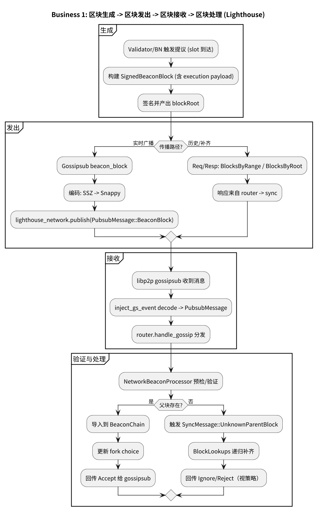
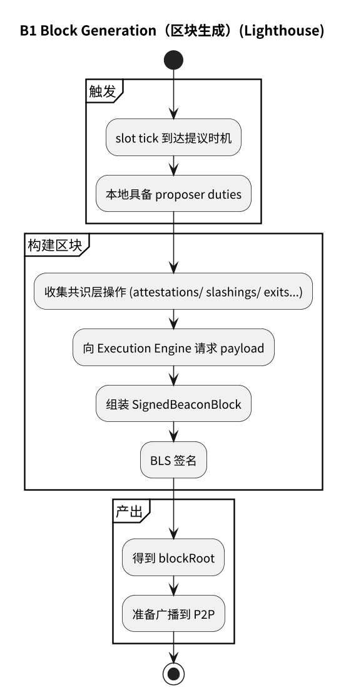
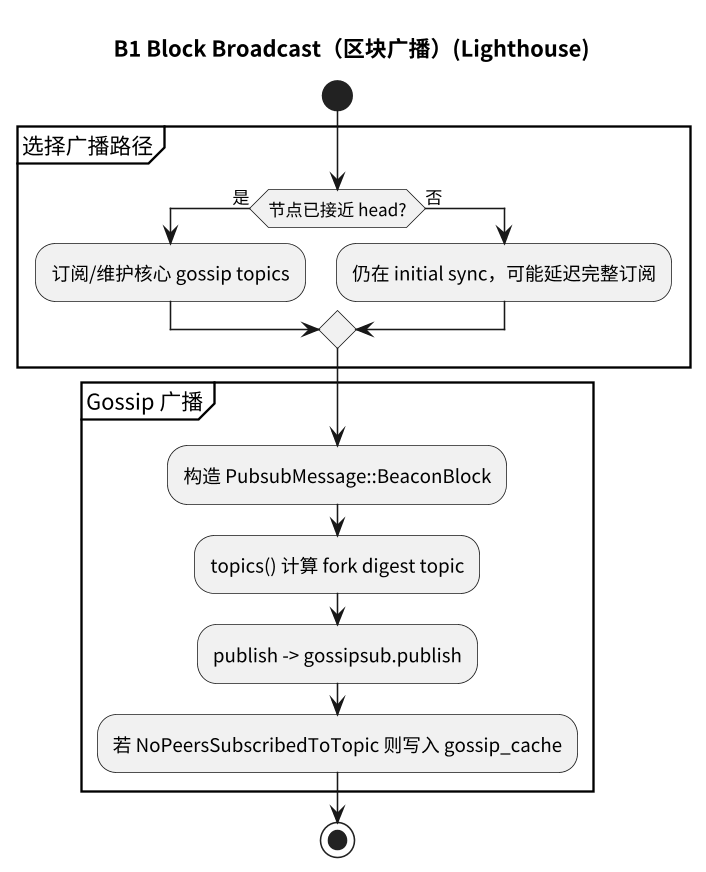
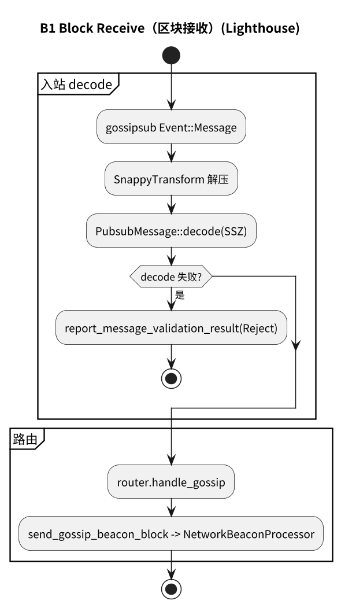
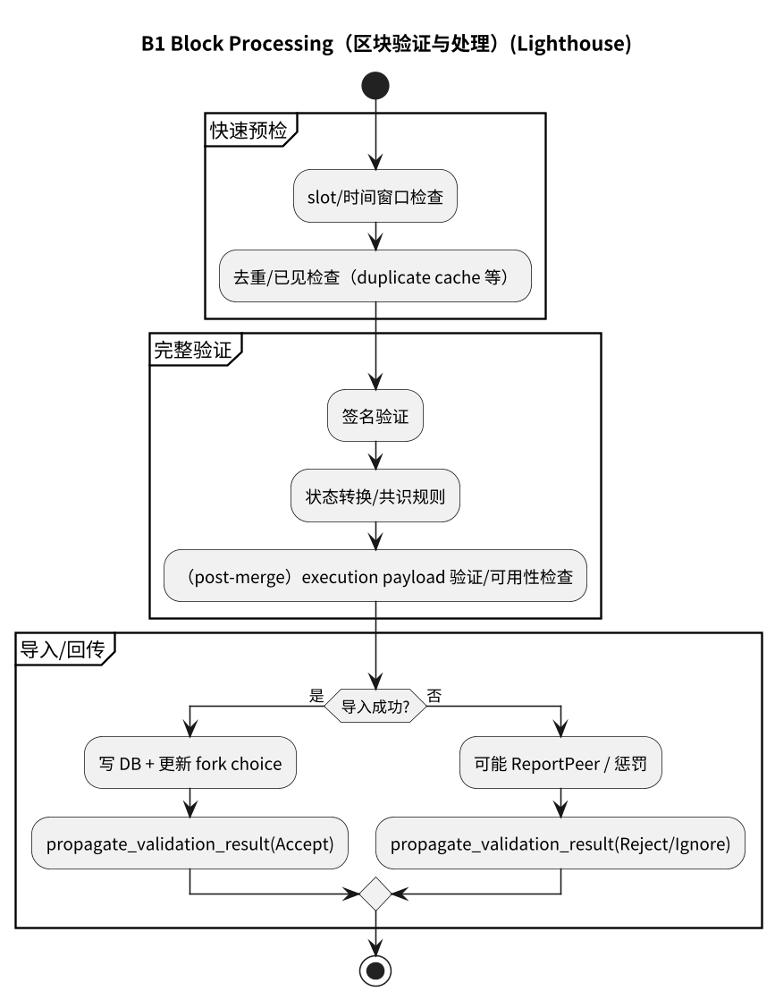

# 附录：业务 1（Block）流程图（Lighthouse）

## 1.1 主流程

## 1.2 子流程

- [1.2.1 区块生成](#121-区块生成)
- [1.2.2 区块广播](#122-区块广播)
- [1.2.3 区块接收](#123-区块接收)
- [1.2.4 区块处理](#124-区块处理)

### 1.2.1 区块生成

### 1.2.2 区块广播

### 1.2.3 区块接收

### 1.2.4 区块处理

## 1.3 流程图源文件

- `img/lighthouse/business1_block_flow.puml`
- `img/lighthouse/business1_block_generation.puml`
- `img/lighthouse/business1_block_broadcast.puml`
- `img/lighthouse/business1_block_receive.puml`
- `img/lighthouse/business1_block_processing.puml`
