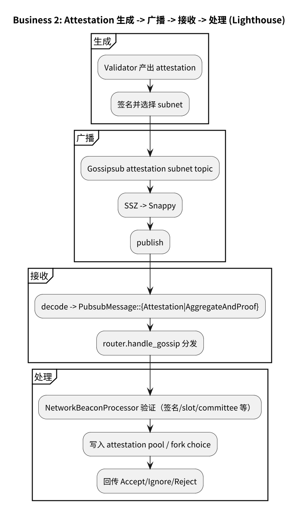
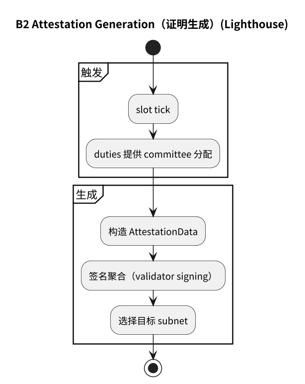
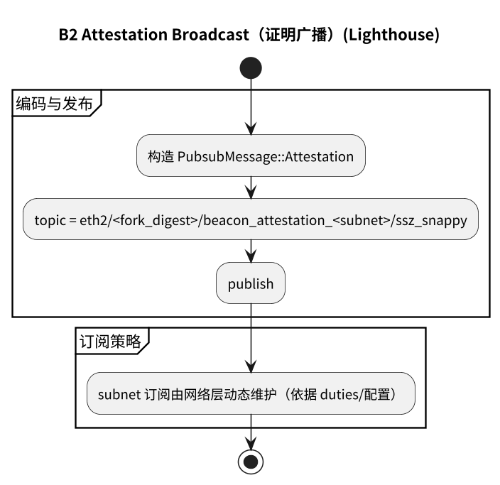
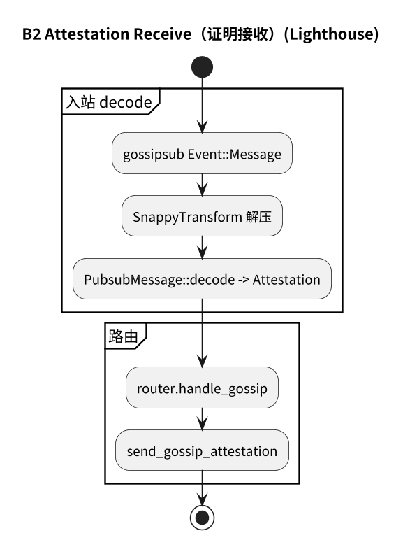
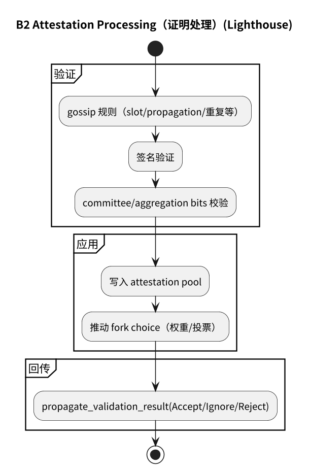
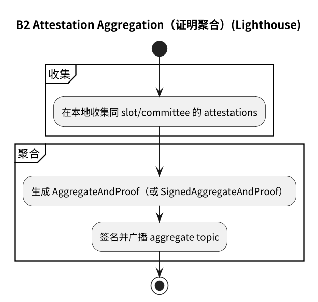

# 附录：业务 2（Attestation）流程图（Lighthouse）

## 2.1 主流程

## 2.2 子流程

- [2.2.1 证明生成](#221-证明生成)
- [2.2.2 证明广播](#222-证明广播)
- [2.2.3 证明接收](#223-证明接收)
- [2.2.4 证明处理](#224-证明处理)
- [2.2.5 证明聚合](#225-证明聚合)

### 2.2.1 证明生成

### 2.2.2 证明广播

### 2.2.3 证明接收

### 2.2.4 证明处理

### 2.2.5 证明聚合

## 2.3 流程图源文件

- `img/lighthouse/business2_attestation_flow.puml`
- `img/lighthouse/business2_attestation_generation.puml`
- `img/lighthouse/business2_attestation_broadcast.puml`
- `img/lighthouse/business2_attestation_receive.puml`
- `img/lighthouse/business2_attestation_processing.puml`
- `img/lighthouse/business2_attestation_aggregation.puml`
