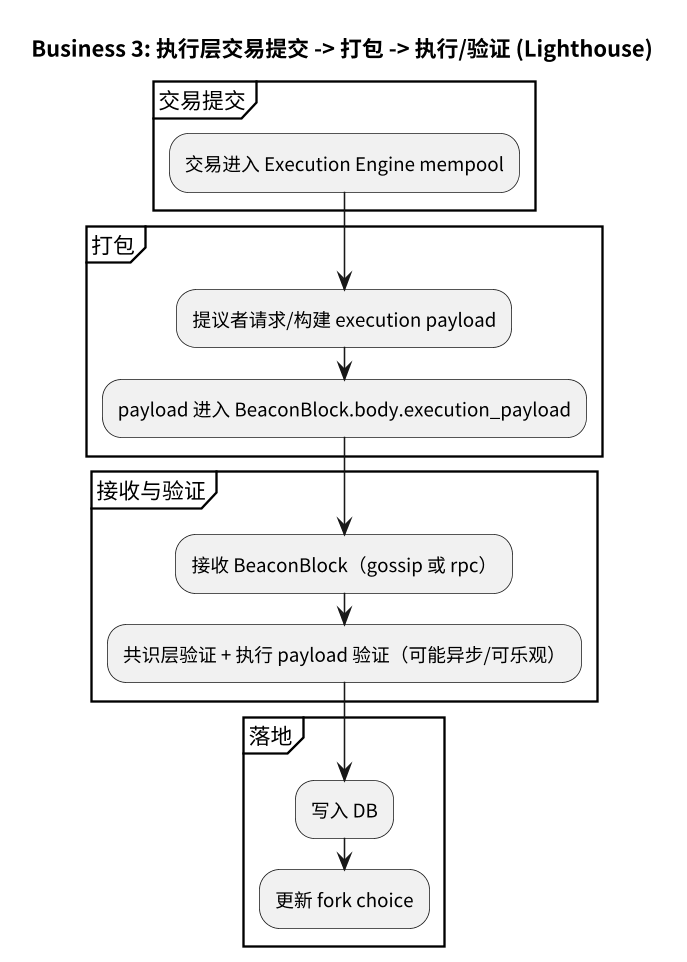
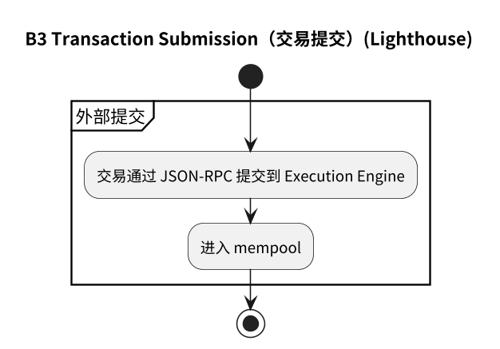
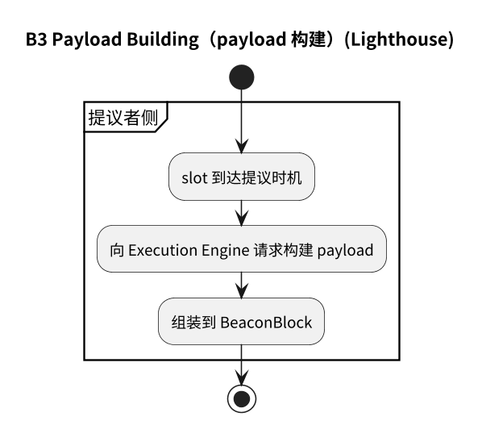
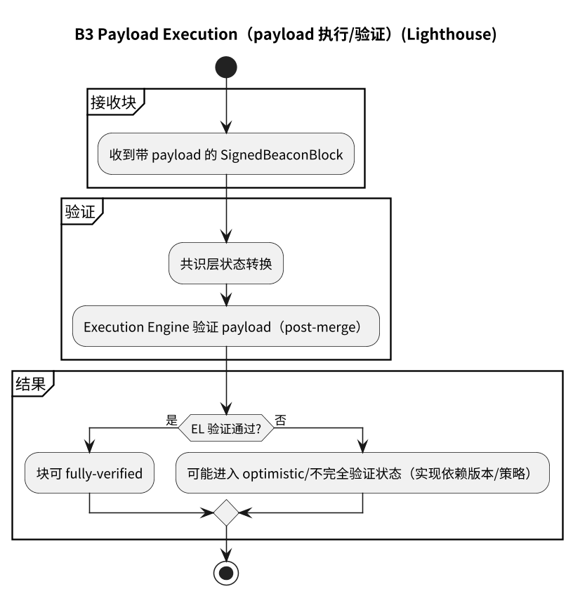
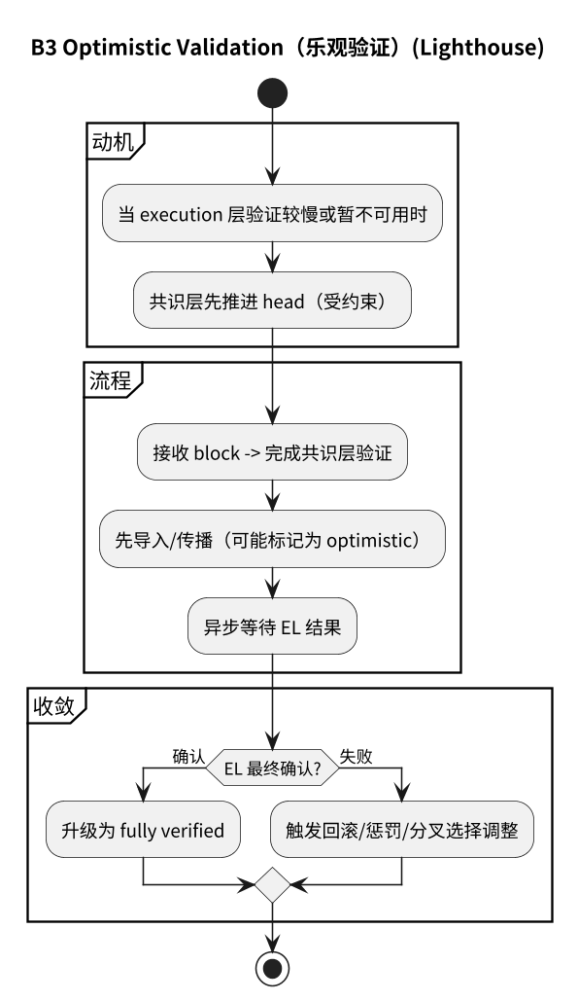

# 附录：业务 3（Execution）流程图（Lighthouse）

## 3.1 主流程

## 3.2 子流程

- [3.2.1 交易提交](#321-交易提交)
- [3.2.2 Payload 构建](#322-payload-构建)
- [3.2.3 Payload 执行/验证](#323-payload-执行验证)
- [3.2.4 乐观验证](#324-乐观验证)

### 3.2.1 交易提交

### 3.2.2 Payload 构建

### 3.2.3 Payload 执行/验证

### 3.2.4 乐观验证

## 3.3 流程图源文件

- `img/lighthouse/business3_execution_flow.puml`
- `img/lighthouse/business3_transaction_submission.puml`
- `img/lighthouse/business3_payload_building.puml`
- `img/lighthouse/business3_payload_execution.puml`
- `img/lighthouse/business3_optimistic_validation.puml`
