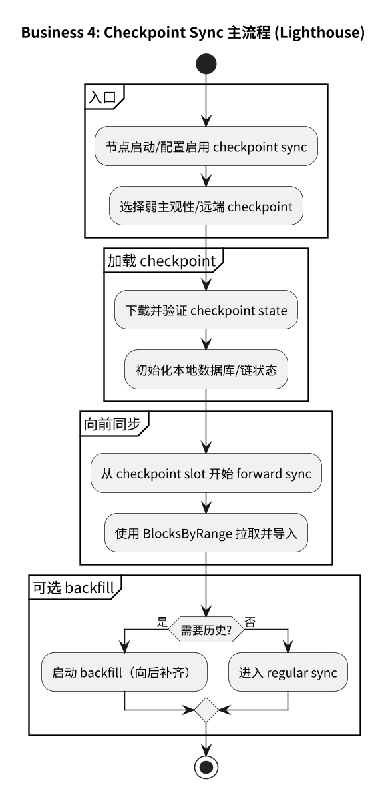
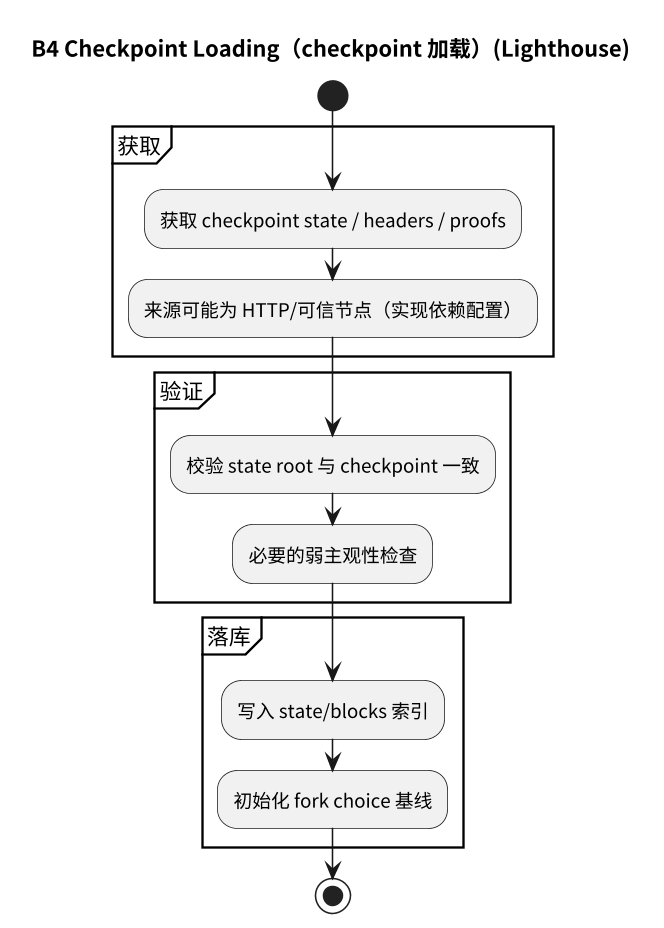
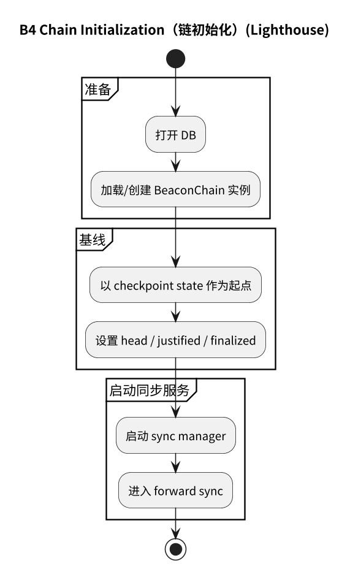
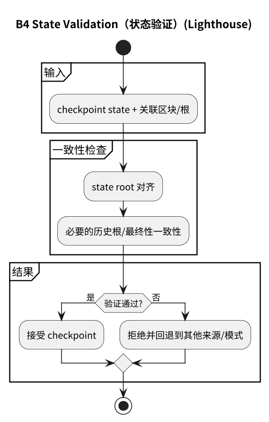
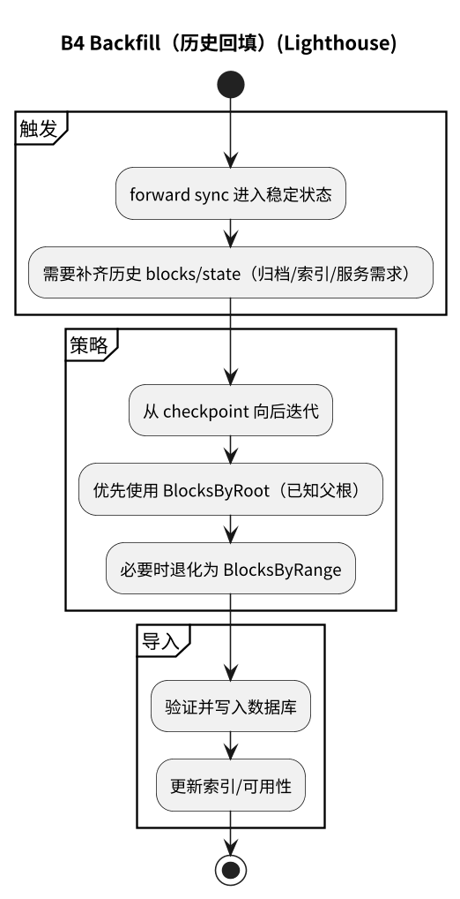

# 附录：业务 4（Checkpoint/Backfill）流程图（Lighthouse）

## 4.1 主流程

## 4.2 子流程

- [4.2.1 Checkpoint 加载](#421-checkpoint-加载)
- [4.2.2 链初始化](#422-链初始化)
- [4.2.3 状态验证](#423-状态验证)
- [4.2.4 Backfill](#424-backfill)

### 4.2.1 Checkpoint 加载

### 4.2.2 链初始化

### 4.2.3 状态验证

### 4.2.4 Backfill

## 4.3 流程图源文件

- `img/lighthouse/business4_checkpoint_flow.puml`
- `img/lighthouse/business4_checkpoint_loading.puml`
- `img/lighthouse/business4_chain_initialization.puml`
- `img/lighthouse/business4_state_validation.puml`
- `img/lighthouse/business4_backfill.puml`

> 说明：Lighthouse 目录下也保留了更细的 checkpoint/backfill 子图（`business4_checkpoint_*`），可在主章节（如 checkpoint sync 章节）直接引用。
