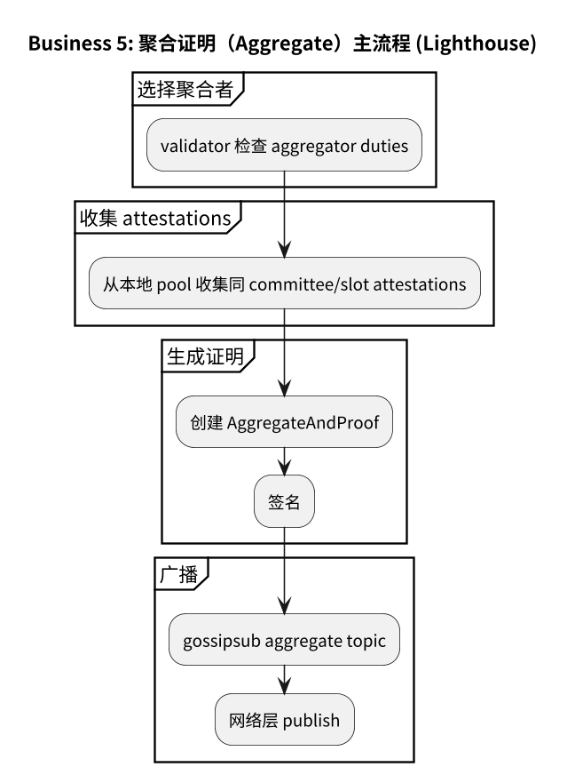
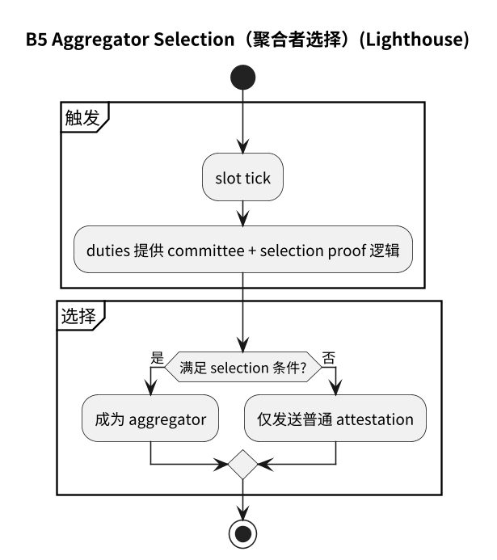
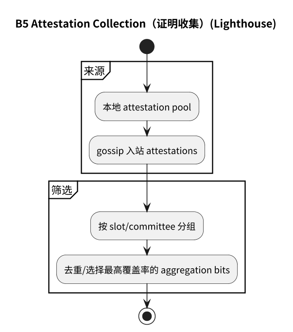
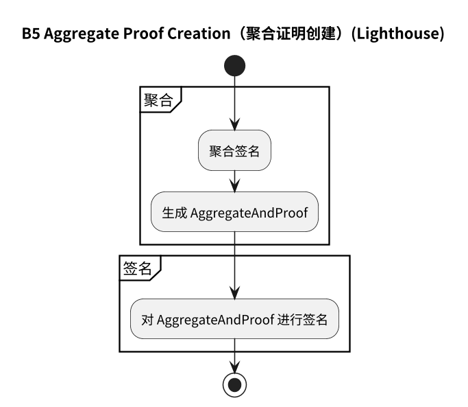
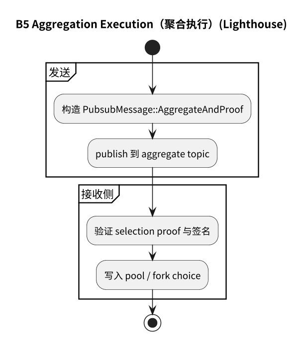
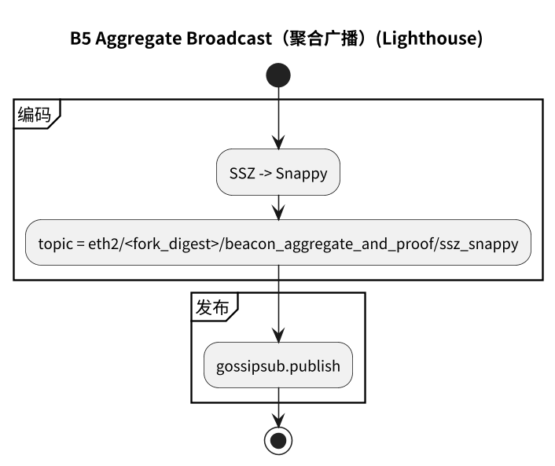

# 附录：业务 5（Aggregate）流程图（Lighthouse）

## 5.1 主流程

## 5.2 子流程

- [5.2.1 聚合者选择](#521-聚合者选择)
- [5.2.2 证明收集](#522-证明收集)
- [5.2.3 聚合证明创建](#523-聚合证明创建)
- [5.2.4 聚合执行](#524-聚合执行)
- [5.2.5 聚合广播](#525-聚合广播)

### 5.2.1 聚合者选择

### 5.2.2 证明收集

### 5.2.3 聚合证明创建

### 5.2.4 聚合执行

### 5.2.5 聚合广播

## 5.3 流程图源文件

- `img/lighthouse/business5_aggregate_flow.puml`
- `img/lighthouse/business5_aggregator_selection.puml`
- `img/lighthouse/business5_attestation_collection.puml`
- `img/lighthouse/business5_aggregate_proof_creation.puml`
- `img/lighthouse/business5_aggregation_execution.puml`
- `img/lighthouse/business5_aggregate_broadcast.puml`
