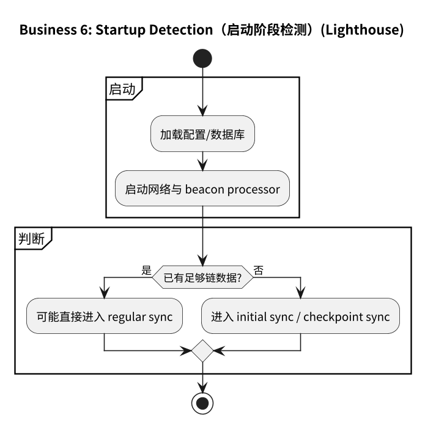
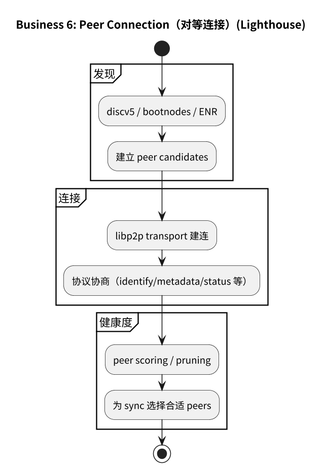
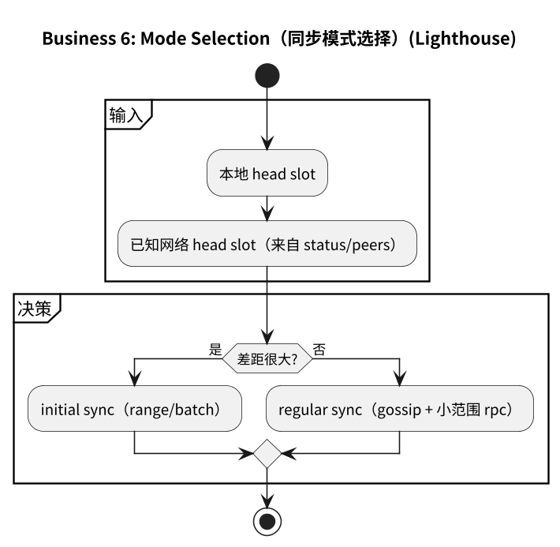
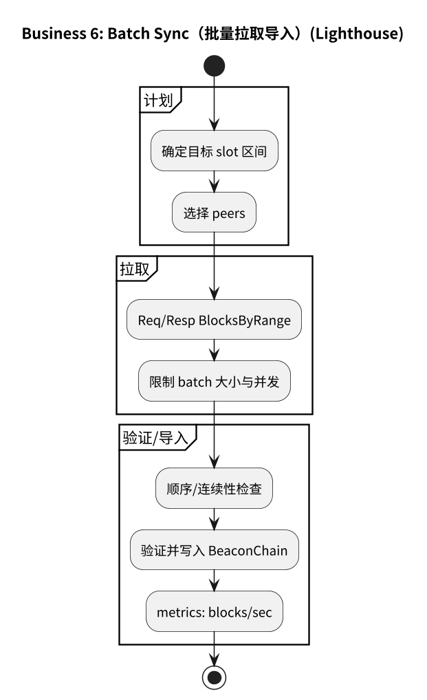
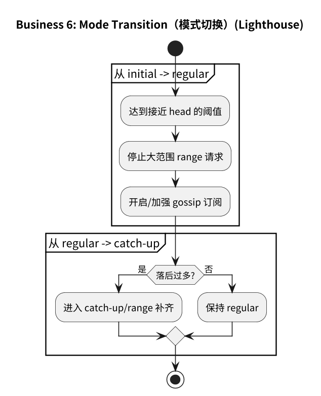

# 附录：业务 6（Initial Sync）流程图（Lighthouse）

## 6.1 主流程

## 6.2 子流程

- [6.2.1 启动检测](#621-启动检测)
- [6.2.2 对等连接](#622-对等连接)
- [6.2.3 模式选择](#623-模式选择)
- [6.2.4 批量同步](#624-批量同步)
- [6.2.5 模式切换](#625-模式切换)

### 6.2.1 启动检测

### 6.2.2 对等连接

### 6.2.3 模式选择

### 6.2.4 批量同步

### 6.2.5 模式切换

## 6.3 流程图源文件

- `img/lighthouse/business6_initial_sync_flow.puml`
- `img/lighthouse/business6_startup_detection.puml`
- `img/lighthouse/business6_peer_connection.puml`
- `img/lighthouse/business6_mode_selection.puml`
- `img/lighthouse/business6_batch_sync.puml`
- `img/lighthouse/business6_mode_transition.puml`

> 说明：Lighthouse 目录下也保留了更细的 initial-sync 子图（`business6_initial_sync_*`）。
