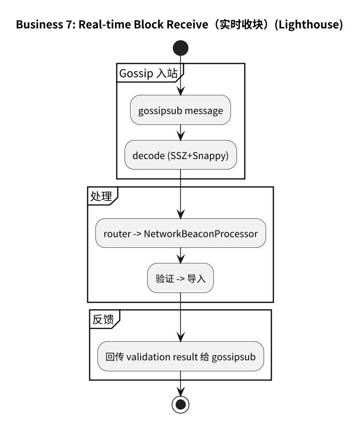
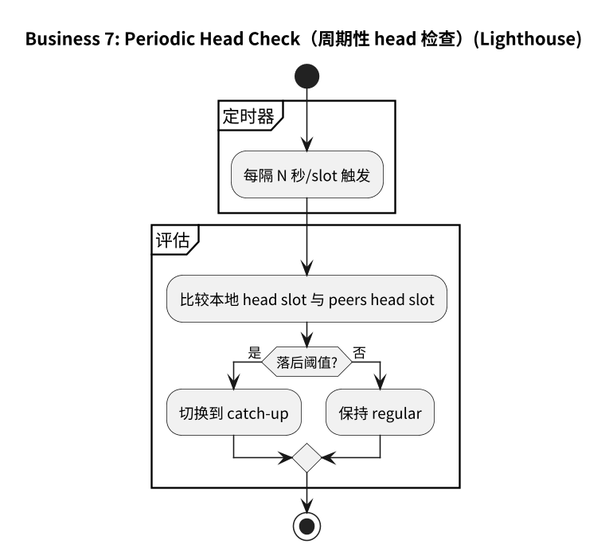
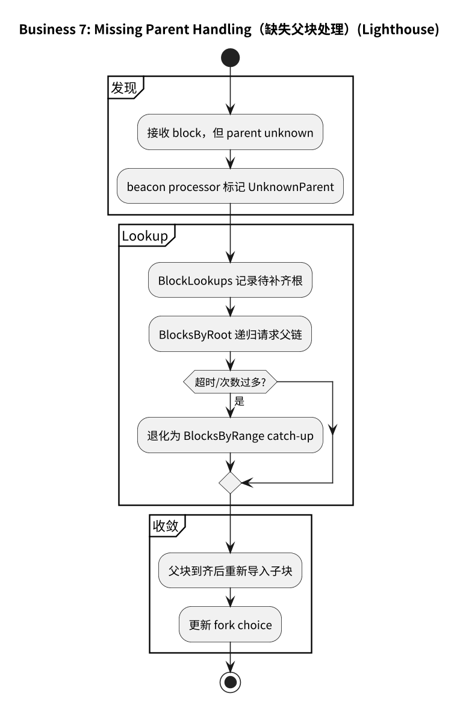
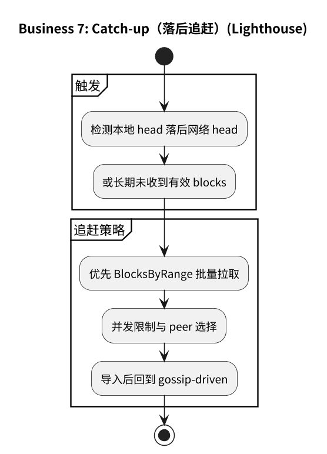
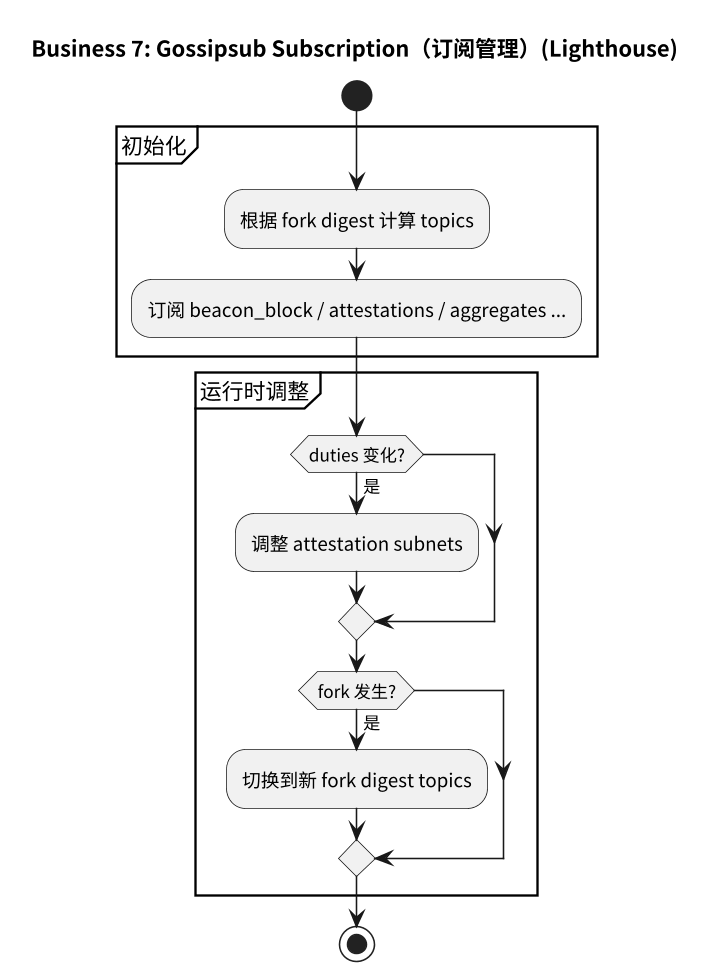
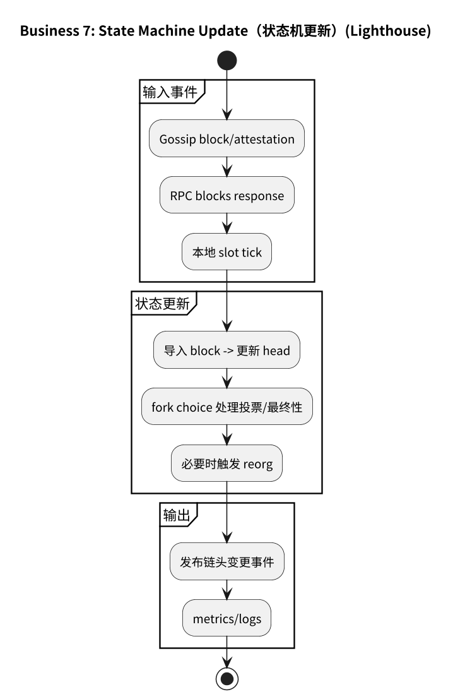

# 附录：业务 7（Regular Sync）流程图（Lighthouse）

## 7.1 主流程

## 7.2 子流程

- [7.2.1 实时收块](#721-实时收块)
- [7.2.2 周期性 head 检查](#722-周期性-head-检查)
- [7.2.3 Missing parent 处理](#723-missing-parent-处理)
- [7.2.4 Catch-up](#724-catch-up)
- [7.2.5 Gossipsub 订阅管理](#725-gossipsub-订阅管理)
- [7.2.6 状态机更新](#726-状态机更新)

### 7.2.1 实时收块

### 7.2.2 周期性 head 检查

### 7.2.3 Missing parent 处理

### 7.2.4 Catch-up

### 7.2.5 Gossipsub 订阅管理

### 7.2.6 状态机更新

## 7.3 流程图源文件

- `img/lighthouse/business7_regular_sync_flow.puml`
- `img/lighthouse/business7_real_time_block_receive.puml`
- `img/lighthouse/business7_periodic_head_check.puml`
- `img/lighthouse/business7_missing_parent_handling.puml`
- `img/lighthouse/business7_catch_up.puml`
- `img/lighthouse/business7_gossipsub_subscription.puml`
- `img/lighthouse/business7_state_machine_update.puml`
