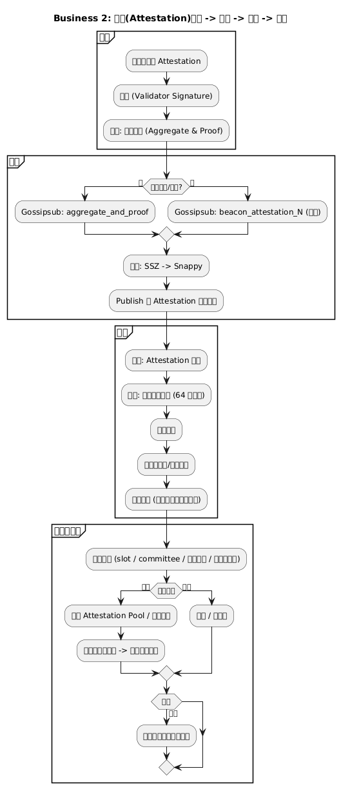
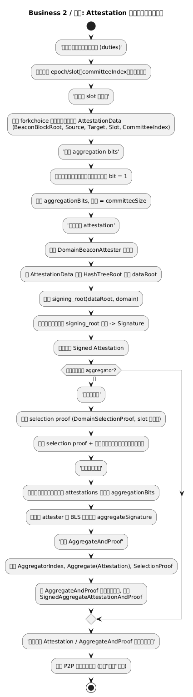
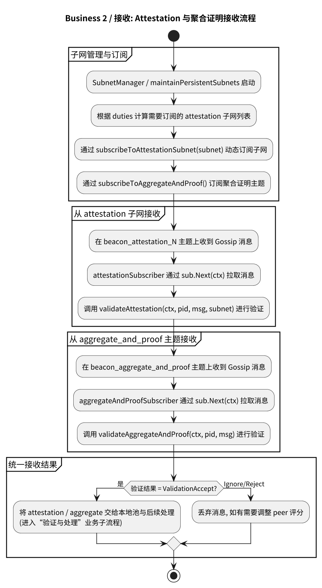
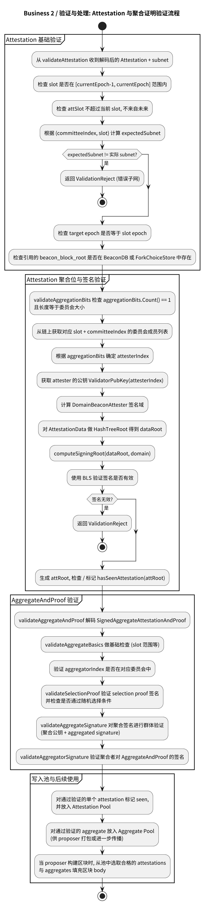

# 附录：业务 2 – Attestation 生成与处理

本页展示 Attestation 从验证者本地生成、通过子网主题广播、被其他节点接收并完成验证与处理的完整流程。

---

## 业务 2：Attestation 生成与处理

### 主流程

子流程跳转：

- [Attestation 生成流程](#b2-attestation-generation)
- [Attestation 广播流程](#b2-attestation-broadcast)
- [Attestation 接收流程](#b2-attestation-receive)
- [Attestation 验证与处理流程](#b2-attestation-processing)

### B2 Attestation Generation（生成） {#b2-attestation-generation}

### B2 Attestation Broadcast（广播） {#b2-attestation-broadcast}

### B2 Attestation Receive（接收） {#b2-attestation-receive}

### B2 Attestation Processing（验证与处理） {#b2-attestation-processing}

