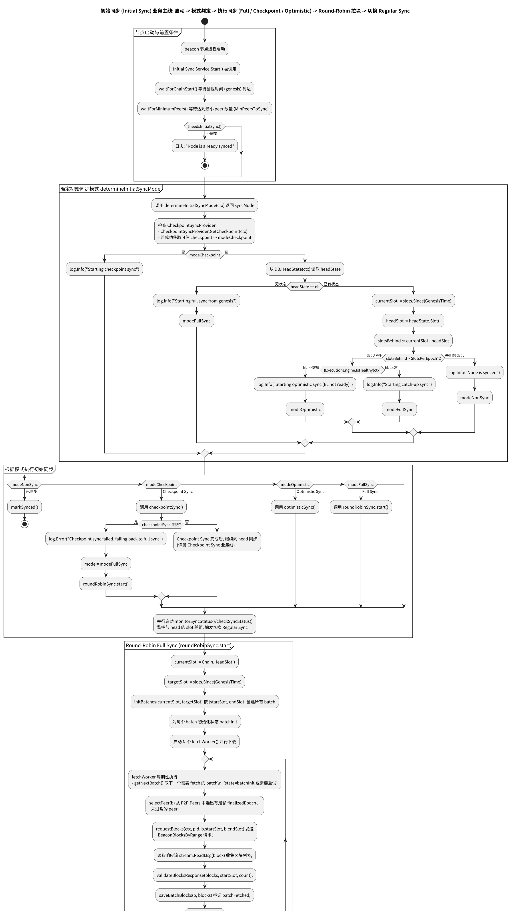
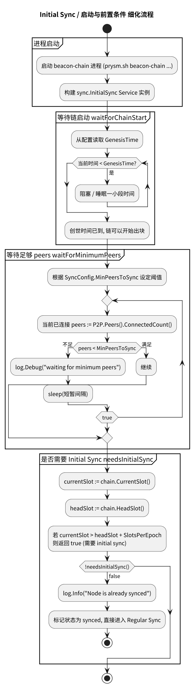
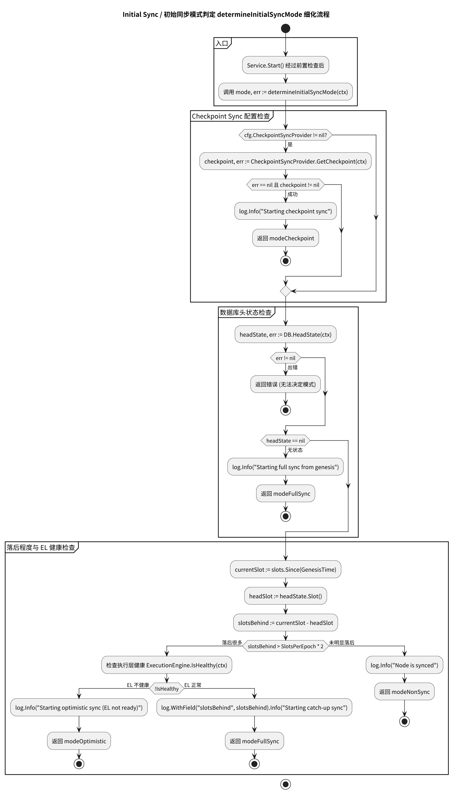
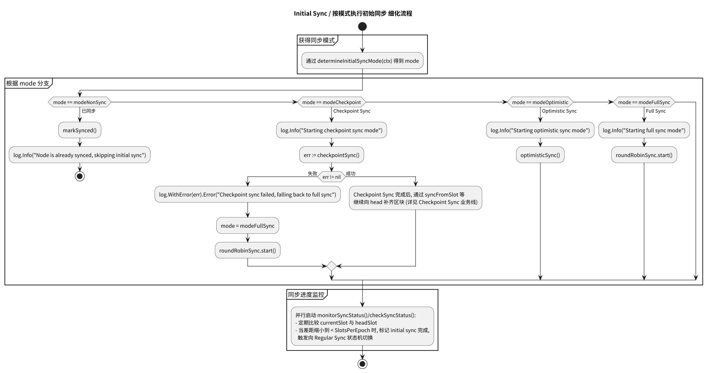
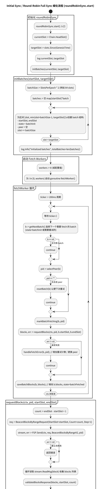
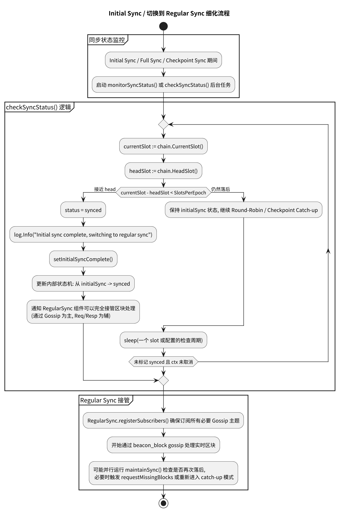

# 附录：业务 6 – Initial Sync 启动与模式选择

本页展示 Initial Sync 从节点启动、前置条件检查、同步模式选择，到执行 Full / Checkpoint / Optimistic Sync 并切换到 Regular Sync 的完整流程。

---

## 业务 6：Initial Sync 启动与模式选择

### 主流程

子流程跳转：

- [启动与前置条件检查](#b6-initial-bootstrap)
- [同步模式选择](#b6-initial-mode-selection)
- [按模式执行同步逻辑](#b6-initial-execute-mode)
- [Round-Robin Full Sync 细节](#b6-initial-round-robin)
- [切换到 Regular Sync](#b6-initial-transition-regular)

### B6 Initial Sync Bootstrap（启动与前置条件） {#b6-initial-bootstrap}

### B6 Initial Sync Mode Selection（模式选择） {#b6-initial-mode-selection}

### B6 Initial Sync Execute Mode（按模式执行） {#b6-initial-execute-mode}

### B6 Initial Sync Round-Robin（轮询 Full Sync） {#b6-initial-round-robin}

### B6 Initial Sync Transition to Regular（切换到 Regular Sync） {#b6-initial-transition-regular}

