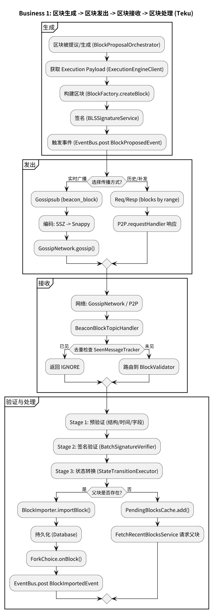
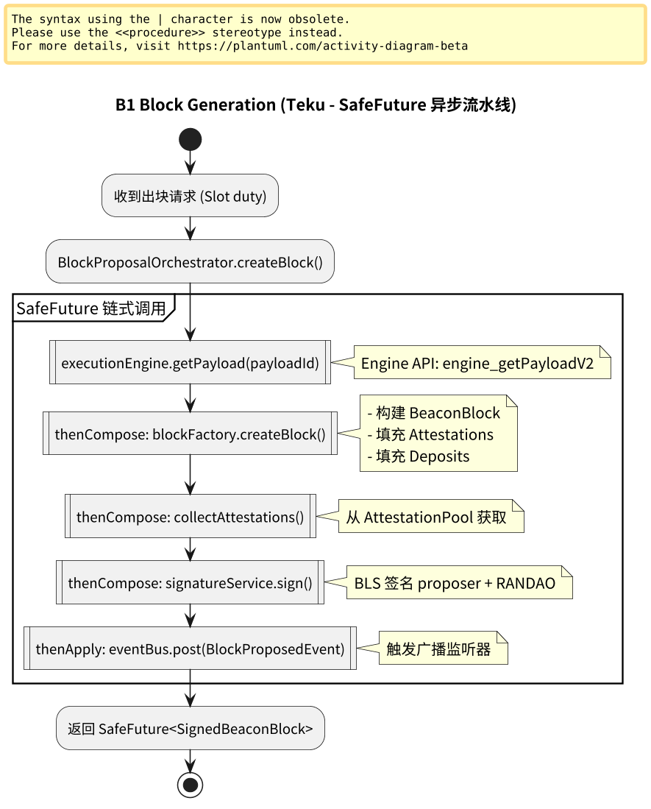
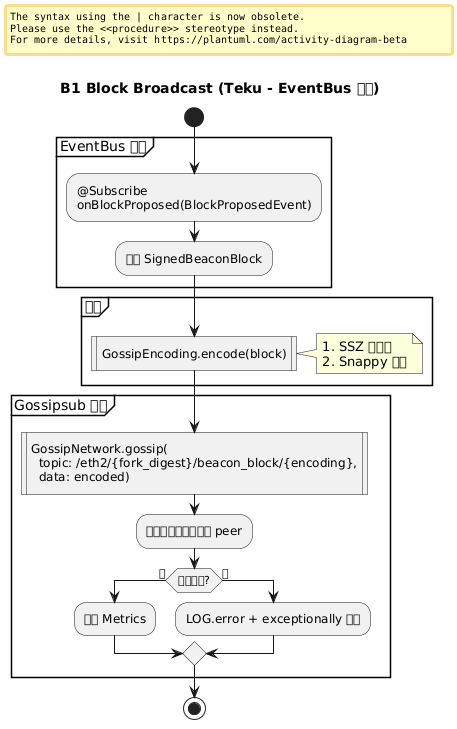
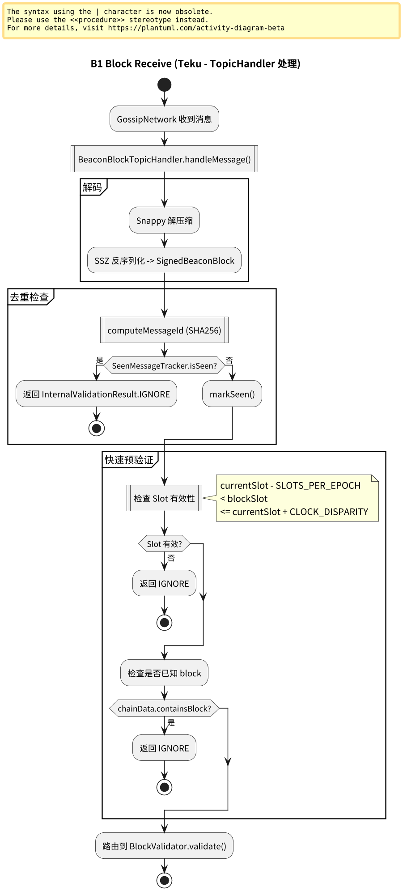
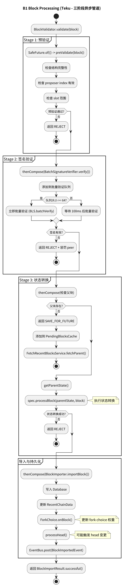

# 附录：业务 1 – 区块生成与处理（Block Pipeline）

本页展示 Teku 中区块从本地生成、通过 P2P 网络广播、被其他节点接收并进入 Block Processing Pipeline 完成验证与处理的完整流程。

> **Teku 特点**：采用 SafeFuture 异步流水线，EventBus 事件驱动，与 Prysm 的 Go Channel 模型不同。

---

## 业务 1：区块生成与处理（Block Pipeline）

### 主流程



子流程跳转：

- [区块生成流程](#b1-block-generation)
- [区块广播流程](#b1-block-broadcast)
- [区块接收流程](#b1-block-receive)
- [区块验证与处理流程](#b1-block-processing)

### B1 Block Generation（区块生成） {#b1-block-generation}



**关键组件**：
- `BlockProposalOrchestrator`: 协调区块生成
- `ExecutionEngineClient`: 获取 Execution Payload
- `BlockFactory`: 构建区块结构
- `BLSSignatureService`: 签名服务

**Teku 特点**：
```java
// 使用 SafeFuture 链式异步调用
return executionEngine.getPayload(payloadId)
  .thenCompose(payload -> blockFactory.createBlock(payload))
  .thenCompose(block -> signatureService.sign(block))
  .thenApply(signedBlock -> {
    eventBus.post(new BlockProposedEvent(signedBlock));
    return signedBlock;
  });
```

### B1 Block Broadcast（区块广播） {#b1-block-broadcast}



**关键组件**：
- `BlockGossipManager`: 管理区块 Gossip
- `GossipNetwork`: libp2p Gossipsub 封装
- `GossipEncoding`: SSZ + Snappy 编码

**Teku 特点**：
```java
// EventBus 驱动的发布流程
@Subscribe
public void onBlockProposed(BlockProposedEvent event) {
  SignedBeaconBlock block = event.getBlock();
  
  // 异步广播
  gossipNetwork.gossip(
    GossipTopics.BEACON_BLOCK,
    gossipEncoding.encode(block)
  ).exceptionally(error -> {
    LOG.error("Failed to gossip block", error);
    return null;
  });
}
```

### B1 Block Receive（区块接收） {#b1-block-receive}



**关键组件**：
- `BeaconBlockTopicHandler`: Gossipsub 区块主题处理器
- `SeenMessageTracker`: 去重缓存（Caffeine）
- `BlockImportChannel`: 区块导入通道

**Teku 特点**：
```java
@Override
public SafeFuture<InternalValidationResult> handleMessage(
    Eth2PreparedGossipMessage message) {
  
  SignedBeaconBlock block = message.getMessage();
  
  // 去重检查
  if (seenTracker.isSeen(block.getRoot())) {
    return SafeFuture.completedFuture(InternalValidationResult.IGNORE);
  }
  
  // 路由到验证管道
  return validator.validate(block)
    .thenCompose(result -> {
      if (result.isAccept()) {
        return blockImportChannel.importBlock(block);
      }
      return SafeFuture.completedFuture(result);
    });
}
```

### B1 Block Processing（区块验证与处理） {#b1-block-processing}



**关键组件**：
- `BlockValidator`: 三阶段验证器
- `StateTransitionExecutor`: 状态转换
- `ForkChoice`: Fork choice 更新
- `BlockImporter`: 区块导入器

**Teku 特点**：
```java
// 三阶段异步验证管道
public SafeFuture<BlockImportResult> processBlock(SignedBeaconBlock block) {
  return SafeFuture.of(() -> {
    // Stage 1: 预验证
    preValidate(block);
    return block;
  })
  .thenCompose(b -> {
    // Stage 2: 签名验证（可批量）
    return batchSignatureVerifier.verify(
      b.getMessage().getProposerIndex(),
      b.getMessage().hashTreeRoot(),
      b.getSignature()
    ).thenApply(valid -> {
      if (!valid) throw new ValidationException("Invalid signature");
      return b;
    });
  })
  .thenCompose(b -> {
    // Stage 3: 状态转换
    return stateTransitionExecutor.applyBlock(
      getParentState(b),
      b
    ).thenApply(newState -> Pair.of(b, newState));
  })
  .thenCompose(pair -> {
    // 持久化
    return persistBlock(pair.getLeft(), pair.getRight())
      .thenCompose(__ -> {
        // 更新 Fork Choice
        return forkChoice.onBlock(
          pair.getLeft().getRoot(),
          pair.getLeft().getParentRoot(),
          pair.getLeft().getSlot(),
          pair.getRight().hashTreeRoot()
        );
      })
      .thenApply(__ -> BlockImportResult.successful());
  })
  .exceptionally(error -> {
    LOG.error("Block processing failed", error);
    return BlockImportResult.failed(error.getMessage());
  });
}
```

---

## 与 Prysm 对比

| 维度 | Prysm | Teku |
|------|-------|------|
| **生成** | BlockOperation | BlockProposalOrchestrator |
| **广播** | p2p.Broadcast() | GossipNetwork.gossip() |
| **接收** | beaconBlockSubscriber | BeaconBlockTopicHandler |
| **去重** | LRU Cache | Caffeine Cache |
| **验证** | 函数链调用 | SafeFuture 流水线 |
| **事件** | Channel 传递 | EventBus 发布 |
| **错误** | error 返回 | exceptionally 处理 |

---

## 流程图源文件

PlantUML 源文件位于：
- `img/teku/business1_block_flow.puml` - 主流程
- `img/teku/business1_block_generation.puml` - 生成子流程
- `img/teku/business1_block_broadcast.puml` - 广播子流程
- `img/teku/business1_block_receive.puml` - 接收子流程
- `img/teku/business1_block_processing.puml` - 处理子流程

---

**最后更新**: 2026-01-13  
**参考章节**: [第 22 章：Block Processing Pipeline](./chapter_22_block_pipeline.md)
