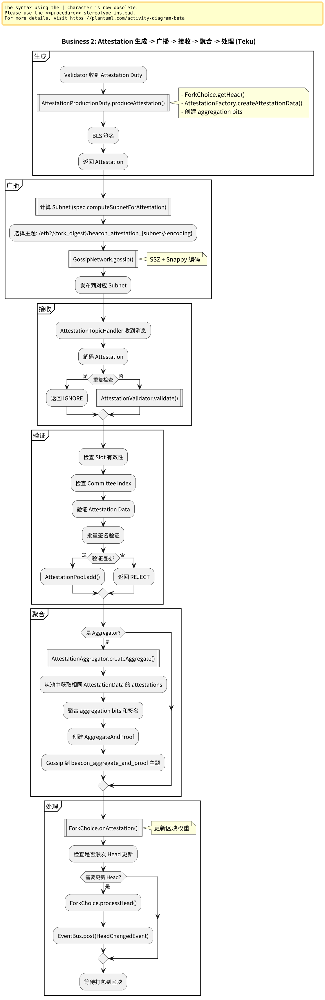
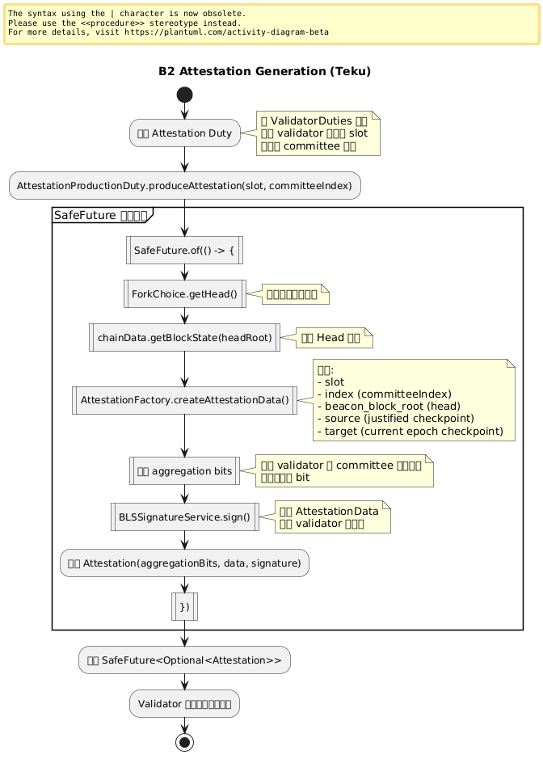
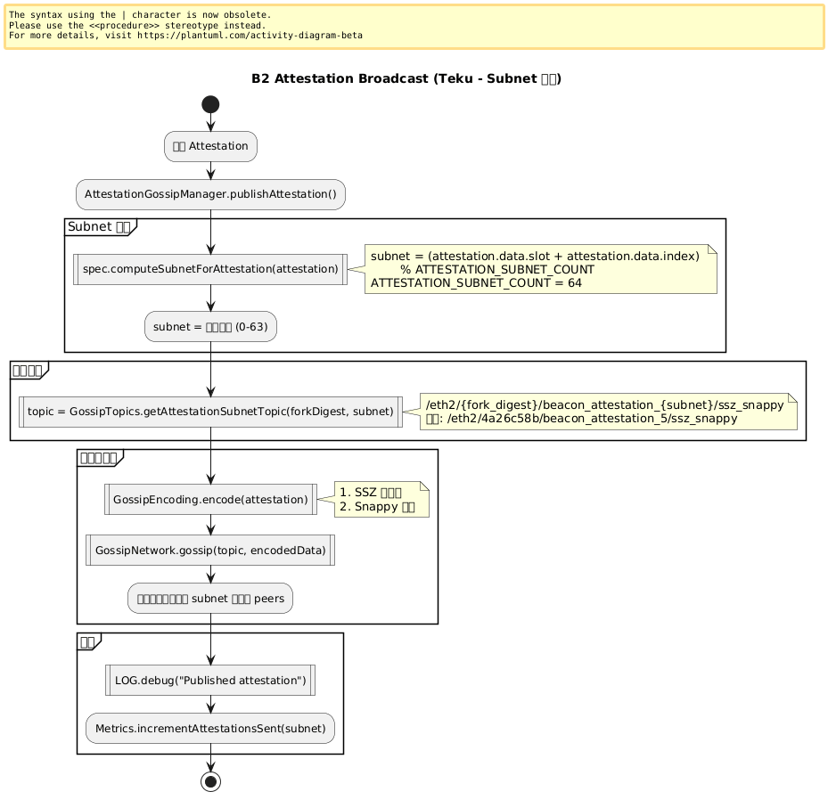
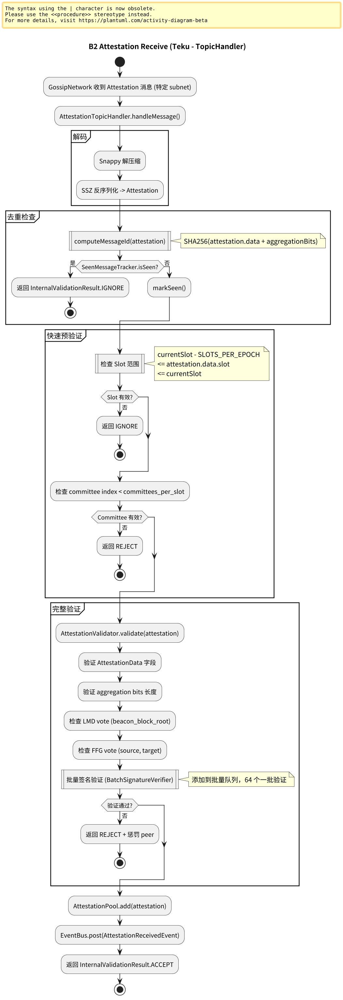
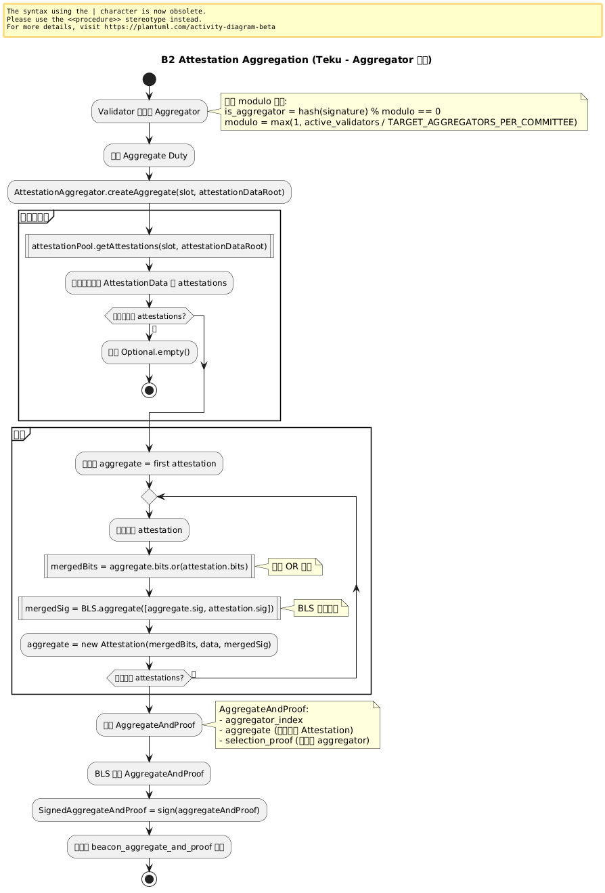
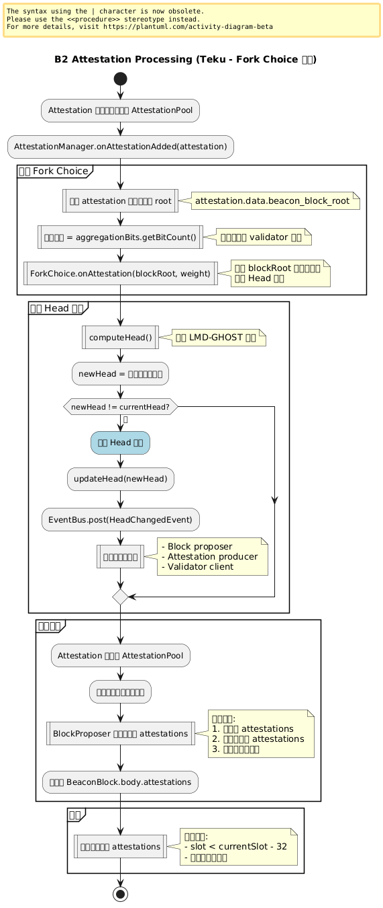

# 附录：业务 2 – Attestation 生成与处理

本页展示 Teku 中 Attestation 从生成、广播到接收处理的完整流程，包括单个 Attestation 和聚合 Attestation。

> **Teku 特点**：使用 AttestationPool 管理，EventBus 驱动，支持批量处理和聚合。

---

## 业务 2：Attestation 生成与处理

### 主流程



子流程跳转：

- [Attestation 生成流程](#b2-attestation-generation)
- [Attestation 广播流程](#b2-attestation-broadcast)
- [Attestation 接收流程](#b2-attestation-receive)
- [Attestation 聚合流程](#b2-attestation-aggregation)
- [Attestation 处理流程](#b2-attestation-processing)

---

## B2 Attestation Generation（Attestation 生成） {#b2-attestation-generation}



**关键组件**：
- `AttestationProductionDuty`: Attestation 生产职责
- `AttestationFactory`: 创建 Attestation
- `ForkChoiceStrategy`: 获取 Head
- `ValidatorApiHandler`: Validator API 处理

**Teku 特点**：
```java
public class AttestationProductionDuty {
  public SafeFuture<Optional<Attestation>> produceAttestation(
      UInt64 slot,
      int committeeIndex) {
    
    return SafeFuture.of(() -> {
      // 1. 获取当前 Head
      Bytes32 headRoot = forkChoice.getHead();
      BeaconState headState = chainData.getBlockState(headRoot);
      
      // 2. 创建 AttestationData
      AttestationData data = attestationFactory.createAttestationData(
        slot,
        committeeIndex,
        headRoot,
        headState
      );
      
      // 3. 获取聚合 bits
      Bitlist aggregationBits = createAggregationBits(committeeIndex);
      
      return Optional.of(new Attestation(aggregationBits, data, signature));
    });
  }
}
```

---

## B2 Attestation Broadcast（Attestation 广播） {#b2-attestation-broadcast}



**关键组件**：
- `AttestationGossipManager`: Attestation Gossip 管理
- `SubnetSubscriptionManager`: Subnet 订阅管理
- `GossipNetwork`: Gossipsub 网络

**Teku 特点**：
```java
public class AttestationGossipManager {
  public SafeFuture<Void> publishAttestation(Attestation attestation) {
    // 计算 subnet
    int subnet = spec.computeSubnetForAttestation(attestation);
    
    // 获取主题
    String topic = GossipTopics.getAttestationSubnetTopic(
      forkDigest, subnet
    );
    
    // 编码并发布
    return gossipNetwork.gossip(
      topic,
      gossipEncoding.encode(attestation)
    ).thenAccept(__ -> {
      LOG.debug("Published attestation", 
        kv("subnet", subnet),
        kv("slot", attestation.getData().getSlot())
      );
    });
  }
}
```

---

## B2 Attestation Receive（Attestation 接收） {#b2-attestation-receive}



**关键组件**：
- `AttestationTopicHandler`: Attestation 主题处理器
- `AttestationValidator`: Attestation 验证器
- `AttestationPool`: Attestation 池

**Teku 特点**：
```java
public class AttestationTopicHandler 
    implements Eth2TopicHandler<Attestation> {
  
  @Override
  public SafeFuture<InternalValidationResult> handleMessage(
      Eth2PreparedGossipMessage message) {
    
    Attestation attestation = message.getMessage();
    
    return SafeFuture.of(() -> {
      // 1. 快速检查
      if (isDuplicate(attestation)) {
        return InternalValidationResult.IGNORE;
      }
      
      // 2. 验证
      return validator.validate(attestation);
    })
    .thenCompose(result -> {
      if (result.isAccept()) {
        // 3. 添加到池
        attestationPool.add(attestation);
        
        // 4. 触发聚合检查
        checkForAggregation(attestation);
      }
      return SafeFuture.completedFuture(result);
    });
  }
}
```

---

## B2 Attestation Aggregation（Attestation 聚合） {#b2-attestation-aggregation}



**关键组件**：
- `AttestationAggregator`: 聚合器
- `AggregateAttestationBuilder`: 构建聚合 Attestation
- `ValidatorDuties`: Validator 职责管理

**Teku 特点**：
```java
public class AttestationAggregator {
  public SafeFuture<Optional<Attestation>> createAggregate(
      UInt64 slot,
      Bytes32 attestationDataRoot) {
    
    return SafeFuture.of(() -> {
      // 1. 从池中获取相同 AttestationData 的 attestations
      List<Attestation> matching = attestationPool.getAttestations(
        slot, attestationDataRoot
      );
      
      if (matching.isEmpty()) {
        return Optional.empty();
      }
      
      // 2. 聚合
      Attestation aggregate = matching.get(0);
      for (int i = 1; i < matching.size(); i++) {
        aggregate = aggregateWith(aggregate, matching.get(i));
      }
      
      return Optional.of(aggregate);
    });
  }
  
  private Attestation aggregateWith(Attestation a1, Attestation a2) {
    // 合并 aggregation bits
    Bitlist mergedBits = a1.getAggregationBits()
      .or(a2.getAggregationBits());
    
    // 合并签名
    BLSSignature mergedSig = BLS.aggregate(
      List.of(a1.getSignature(), a2.getSignature())
    );
    
    return new Attestation(mergedBits, a1.getData(), mergedSig);
  }
}
```

---

## B2 Attestation Processing（Attestation 处理） {#b2-attestation-processing}



**关键组件**：
- `AttestationManager`: Attestation 管理器
- `ForkChoice`: 更新 Fork Choice
- `BlockProposer`: 打包到区块

**Teku 特点**：
```java
public class AttestationManager {
  public void onAttestationAdded(Attestation attestation) {
    // 1. 更新 Fork Choice
    forkChoice.onAttestation(
      attestation.getData().getBeaconBlockRoot(),
      calculateWeight(attestation)
    );
    
    // 2. 通知区块打包
    eventBus.post(new AttestationAddedEvent(attestation));
    
    // 3. 检查是否触发 Head 更新
    if (shouldUpdateHead()) {
      forkChoice.processHead();
    }
  }
  
  private UInt64 calculateWeight(Attestation attestation) {
    // 计算 attestation 的权重（投票的 validator 数量）
    return UInt64.valueOf(
      attestation.getAggregationBits().getBitCount()
    );
  }
}
```

---

## 与 Prysm 对比

| 维度 | Prysm | Teku |
|------|-------|------|
| **生成** | AttestationProducer | AttestationProductionDuty |
| **Subnet** | ComputeSubnetForAttestation | spec.computeSubnetForAttestation |
| **池管理** | AttestationPool (map) | AttestationPool (Caffeine) |
| **聚合** | AggregateAttestations | AttestationAggregator |
| **验证** | 单函数验证 | AttestationValidator 类 |
| **事件** | Channel | EventBus |

---

## 流程图源文件

PlantUML 源文件位于：
- `img/teku/business2_attestation_flow.puml` - 主流程
- `img/teku/business2_attestation_generation.puml` - 生成子流程
- `img/teku/business2_attestation_broadcast.puml` - 广播子流程
- `img/teku/business2_attestation_receive.puml` - 接收子流程
- `img/teku/business2_attestation_aggregation.puml` - 聚合子流程
- `img/teku/business2_attestation_processing.puml` - 处理子流程

---

**最后更新**: 2026-01-14  
**参考章节**: [第 14 章：消息验证流程](./chapter_14_message_validation.md)
