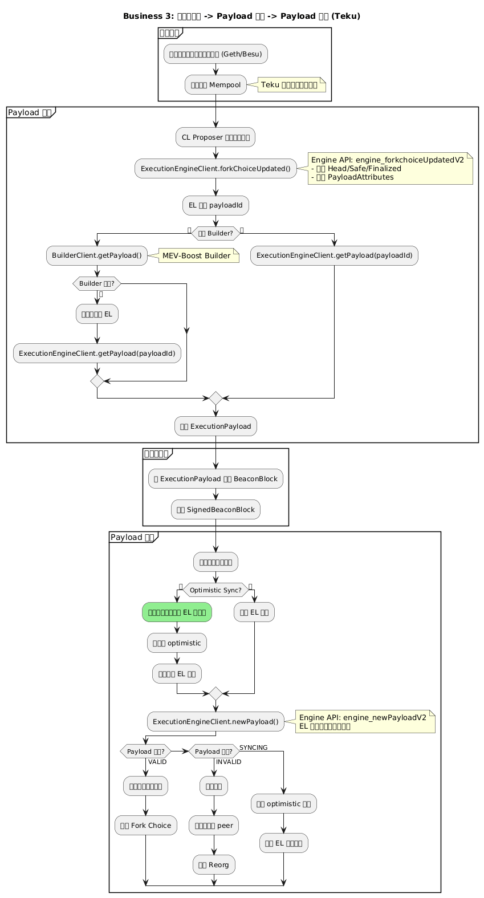
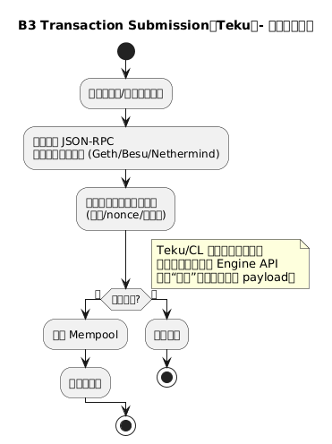
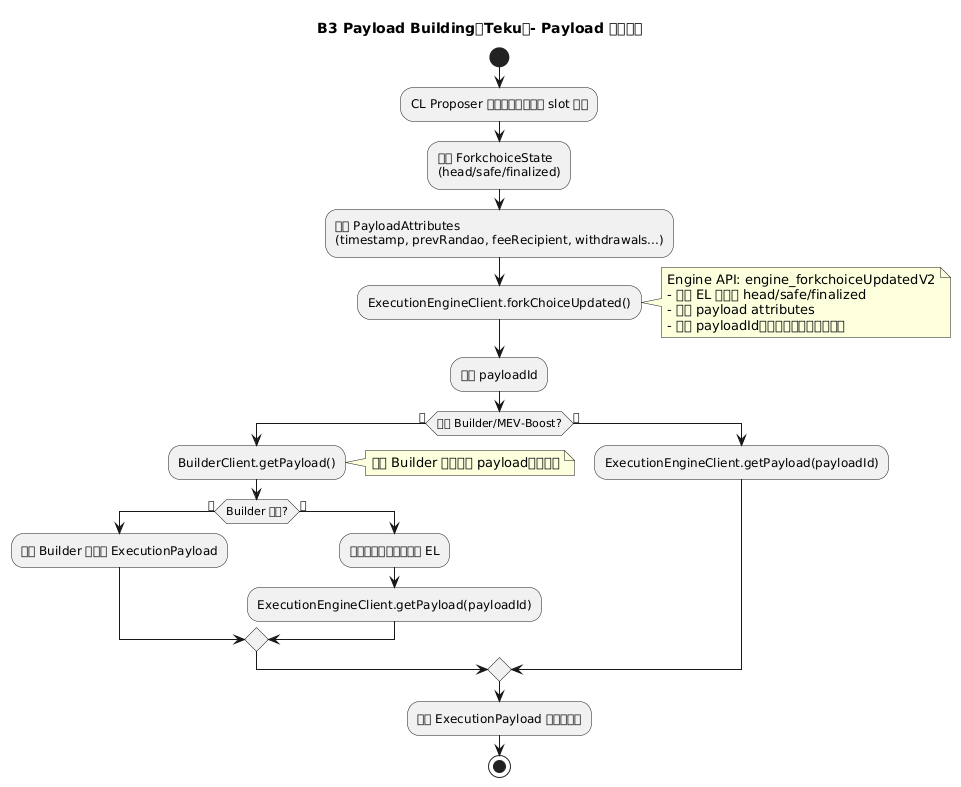
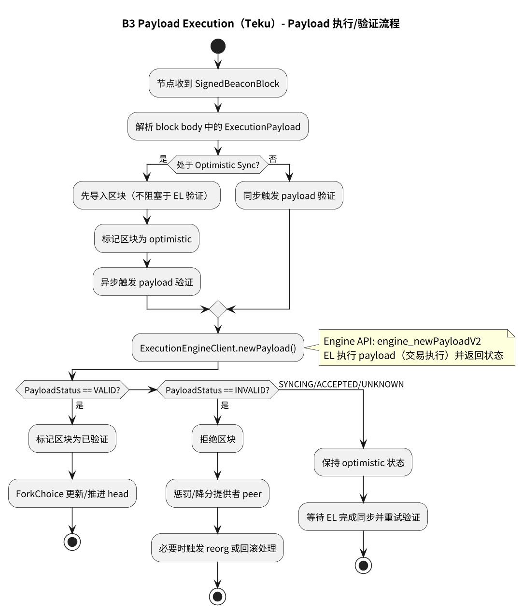
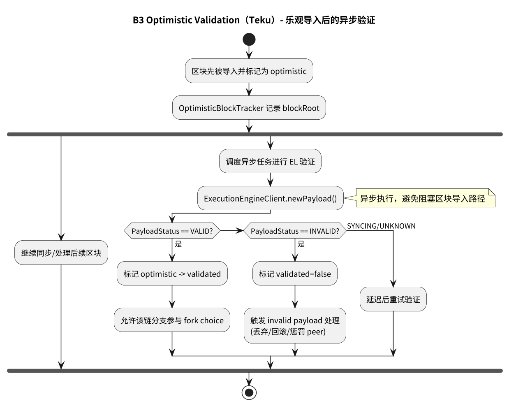

# 附录：业务 3 – 执行层交易 → 打包 → 执行

本页展示 Teku 中执行层交易从提交、构建 Execution Payload、到最终执行的完整流程。

> **Teku 特点**：通过 ExecutionEngineClient 与执行层交互，支持 MEV-Boost 和 Builder API。

---

## 业务 3：执行层交易 → 打包 → 执行

### 主流程



子流程跳转：

- [交易提交流程](#b3-transaction-submission)
- [Payload 构建流程](#b3-payload-building)
- [Payload 执行流程](#b3-payload-execution)
- [Optimistic 验证流程](#b3-optimistic-validation)

---

## B3 Transaction Submission（交易提交） {#b3-transaction-submission}



**关键组件**：
- 用户 → 执行客户端（如 Geth, Besu）
- 执行客户端的 Mempool
- Teku 不直接参与，但通过 Engine API 获取交易

---

## B3 Payload Building（Payload 构建） {#b3-payload-building}



**关键组件**：
- `ExecutionEngineClient`: Engine API 客户端
- `LocalExecutionEngine`: 本地 EL 交互
- `BuilderClient`: MEV-Boost Builder 交互（可选）

**Teku 特点**：
```java
public class ExecutionPayloadProducer {
  public SafeFuture<ExecutionPayload> getExecutionPayload(
      UInt64 slot,
      Bytes32 parentHash) {
    
    // 1. 通知 EL 准备 payload
    return executionEngine.forkChoiceUpdated(
      new ForkchoiceState(headRoot, safeRoot, finalizedRoot),
      new PayloadAttributes(timestamp, prevRandao, suggestedFeeRecipient)
    )
    .thenCompose(result -> {
      String payloadId = result.getPayloadId();
      
      // 2. 检查是否使用 Builder
      if (builderEnabled && shouldUseBuilder(slot)) {
        return getPayloadFromBuilder(slot, parentHash)
          .exceptionallyCompose(error -> {
            // Builder 失败，降级到本地 EL
            LOG.warn("Builder failed, falling back to local EL");
            return executionEngine.getPayload(payloadId);
          });
      } else {
        // 3. 从本地 EL 获取 payload
        return executionEngine.getPayload(payloadId);
      }
    });
  }
}
```

---

## B3 Payload Execution（Payload 执行） {#b3-payload-execution}



**关键组件**：
- `ExecutionPayloadValidator`: Payload 验证器
- `OptimisticSyncService`: 乐观同步服务

**Teku 特点**：
```java
public class ExecutionPayloadValidator {
  public SafeFuture<PayloadStatus> validatePayload(
      ExecutionPayload payload) {
    
    return executionEngine.newPayload(payload)
      .thenApply(status -> {
        switch (status.getStatus()) {
          case VALID:
            LOG.debug("Payload valid", kv("blockHash", payload.getBlockHash()));
            return PayloadStatus.VALID;
            
          case INVALID:
            LOG.warn("Payload invalid", kv("blockHash", payload.getBlockHash()));
            return PayloadStatus.INVALID;
            
          case SYNCING:
            LOG.debug("EL syncing, payload not yet validated");
            return PayloadStatus.SYNCING;
            
          default:
            return PayloadStatus.UNKNOWN;
        }
      });
  }
}
```

---

## B3 Optimistic Validation（Optimistic 验证） {#b3-optimistic-validation}



**关键组件**：
- `OptimisticBlockTracker`: 跟踪 optimistic 区块
- `OptimisticExecutionPayloadExecutor`: 异步执行验证

**Teku 特点**：
```java
public class OptimisticSyncService {
  public SafeFuture<BlockImportResult> importOptimistically(
      SignedBeaconBlock block) {
    
    // 1. 标记为 optimistic
    optimisticTracker.markOptimistic(block.getRoot());
    
    // 2. 立即导入（不等待 EL 验证）
    return blockImporter.importBlock(block)
      .thenCompose(result -> {
        if (result.isSuccessful()) {
          // 3. 异步触发 EL 验证
          schedulePayloadValidation(block);
        }
        return SafeFuture.completedFuture(result);
      });
  }
  
  private void schedulePayloadValidation(SignedBeaconBlock block) {
    ExecutionPayload payload = block.getMessage()
      .getBody()
      .getExecutionPayload();
    
    executionEngine.newPayload(payload)
      .thenAccept(status -> {
        if (status.getStatus() == PayloadStatus.VALID) {
          optimisticTracker.markValidated(block.getRoot(), true);
        } else if (status.getStatus() == PayloadStatus.INVALID) {
          optimisticTracker.markValidated(block.getRoot(), false);
          handleInvalidPayload(block);
        }
      });
  }
}
```

---

## 与 Prysm 对比

| 维度 | Prysm | Teku |
|------|-------|------|
| **Engine API** | ExecutionClient | ExecutionEngineClient |
| **Payload 构建** | PreparePayloadForNextSlot | forkChoiceUpdated + getPayload |
| **Builder 集成** | 内置 MEV-Boost | BuilderClient 可选 |
| **Optimistic** | optimisticStatus | OptimisticBlockTracker |
| **降级策略** | 自动切换 | exceptionallyCompose |
| **异步模型** | Goroutines | SafeFuture 链 |

---

## 流程图源文件

PlantUML 源文件位于：
- `img/teku/business3_execution_flow.puml` - 主流程
- `img/teku/business3_transaction_submission.puml` - 交易提交
- `img/teku/business3_payload_building.puml` - Payload 构建
- `img/teku/business3_payload_execution.puml` - Payload 执行
- `img/teku/business3_optimistic_validation.puml` - Optimistic 验证

---

**最后更新**: 2026-01-14  
**参考章节**: [第 20 章：Optimistic Sync 实现](./chapter_20_optimistic_sync.md)
