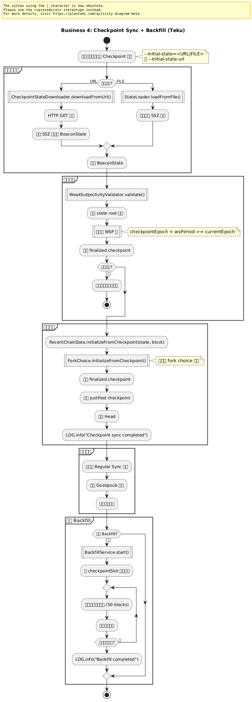
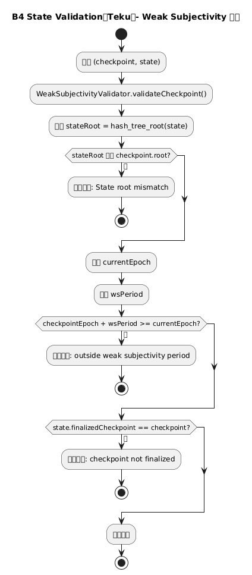
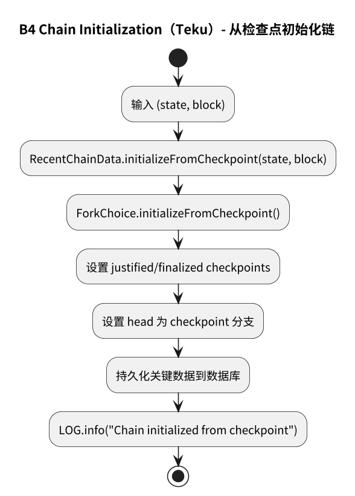
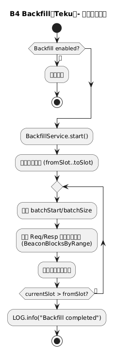

# 附录：业务 4 – Checkpoint Sync 与 Backfill

本页展示 Teku 中 Checkpoint Sync 的完整流程，包括从可信检查点启动和可选的历史区块回填。

> **Teku 特点**：支持从 URL/File 加载检查点，Weak Subjectivity 验证，异步 Backfill。

---

## 业务 4：Checkpoint Sync 与 Backfill

### 主流程



子流程跳转：

- [检查点加载流程](#b4-checkpoint-loading)
- [状态验证流程](#b4-state-validation)
- [链初始化流程](#b4-chain-initialization)
- [Backfill 流程](#b4-backfill)

---

## B4 Checkpoint Loading（检查点加载） {#b4-checkpoint-loading}


**关键组件**：
- `CheckpointSyncConfig`: 配置管理
- `CheckpointStateDownloader`: 状态下载器
- `StateLoader`: 状态加载器

**Teku 特点**：
```java
public class CheckpointSyncService {
  public SafeFuture<BeaconState> loadCheckpointState() {
    if (config.getInitialStatePath().isPresent()) {
      // 从文件加载
      return loadStateFromFile(config.getInitialStatePath().get());
    } else if (config.getInitialStateUrl().isPresent()) {
      // 从 URL 下载
      return downloadStateFromUrl(config.getInitialStateUrl().get());
    } else {
      return SafeFuture.failedFuture(
        new IllegalStateException("No checkpoint configured")
      );
    }
  }
  
  private SafeFuture<BeaconState> downloadStateFromUrl(String url) {
    return httpClient.get(url)
      .thenCompose(response -> {
        // 解码 SSZ
        return SafeFuture.of(() -> 
          spec.deserializeBeaconState(response.getBody())
        );
      })
      .exceptionally(error -> {
        LOG.error("Failed to download checkpoint state", error);
        throw new CheckpointSyncException(error);
      });
  }
}
```

---

## B4 State Validation（状态验证） {#b4-state-validation}



**关键组件**：
- `WeakSubjectivityValidator`: WSP 验证器
- `CheckpointValidator`: 检查点验证器

**Teku 特点**：
```java
public class WeakSubjectivityValidator {
  public boolean validateCheckpoint(
      Checkpoint checkpoint,
      BeaconState state) {
    
    // 1. 验证 state root 匹配
    Bytes32 computedRoot = state.hashTreeRoot();
    if (!computedRoot.equals(checkpoint.getRoot())) {
      LOG.error("State root mismatch");
      return false;
    }
    
    // 2. 验证在 WSP 内
    UInt64 wsPeriod = spec.getWeakSubjectivityPeriod(state);
    UInt64 currentEpoch = spec.getCurrentEpoch(state);
    UInt64 checkpointEpoch = checkpoint.getEpoch();
    
    if (checkpointEpoch.plus(wsPeriod).isLessThan(currentEpoch)) {
      LOG.error("Checkpoint outside weak subjectivity period");
      return false;
    }
    
    // 3. 验证 finalized
    if (!state.getFinalizedCheckpoint().equals(checkpoint)) {
      LOG.warn("Checkpoint not finalized in state");
      return false;
    }
    
    return true;
  }
}
```

---

## B4 Chain Initialization（链初始化） {#b4-chain-initialization}



**关键组件**：
- `RecentChainData`: 链数据管理
- `ForkChoice`: Fork choice 初始化

**Teku 特点**：
```java
public class ChainInitializer {
  public SafeFuture<Void> initializeFromCheckpoint(
      BeaconState state,
      SignedBeaconBlock block) {
    
    return SafeFuture.of(() -> {
      // 1. 设置链状态
      recentChainData.initializeFromCheckpoint(state, block);
      
      // 2. 初始化 Fork Choice
      forkChoice.initializeFromCheckpoint(
        block.getRoot(),
        block.getSlot(),
        state
      );
      
      // 3. 更新 finalized checkpoint
      recentChainData.updateFinalized(
        state.getFinalizedCheckpoint(),
        state.getFinalizedCheckpoint().getRoot()
      );
      
      LOG.info("Chain initialized from checkpoint",
        kv("slot", block.getSlot()),
        kv("root", block.getRoot())
      );
      
      return null;
    });
  }
}
```

---

## B4 Backfill（历史回填） {#b4-backfill}



**关键组件**：
- `BackfillService`: 回填服务
- `BackfillBatchFetcher`: 批量获取器

**Teku 特点**：
```java
public class BackfillService {
  public SafeFuture<Void> startBackfill(
      UInt64 fromSlot,
      UInt64 toSlot) {
    
    if (!config.isBackfillEnabled()) {
      LOG.info("Backfill disabled");
      return SafeFuture.COMPLETE;
    }
    
    LOG.info("Starting backfill",
      kv("from", fromSlot),
      kv("to", toSlot)
    );
    
    return backfillBatches(fromSlot, toSlot)
      .thenAccept(__ -> {
        LOG.info("Backfill completed");
      });
  }
  
  private SafeFuture<Void> backfillBatches(
      UInt64 fromSlot,
      UInt64 toSlot) {
    
    SafeFuture<Void> chain = SafeFuture.COMPLETE;
    
    // 从后向前回填
    UInt64 currentSlot = toSlot;
    while (currentSlot.isGreaterThan(fromSlot)) {
      UInt64 batchStart = currentSlot.minusMinZero(BATCH_SIZE);
      UInt64 batchSize = currentSlot.minus(batchStart);
      
      final UInt64 start = batchStart;
      chain = chain.thenCompose(__ -> 
        fetchAndStoreBatch(start, batchSize)
      );
      
      currentSlot = batchStart;
    }
    
    return chain;
  }
}
```

---

## 与 Prysm 对比

| 维度 | Prysm | Teku |
|------|-------|------|
| **配置** | --checkpoint-sync-url | --initial-state |
| **加载** | LoadCheckpoint | CheckpointSyncService |
| **WSP 验证** | 基础检查 | 完整 WSP 验证 |
| **初始化** | InitializeFromCheckpoint | RecentChainData.initializeFromCheckpoint |
| **Backfill** | 可选 | BackfillService |
| **异步** | Goroutines | SafeFuture 链 |

---

## 流程图源文件

PlantUML 源文件位于：
- `img/teku/business4_checkpoint_flow.puml` - 主流程
- `img/teku/business4_checkpoint_loading.puml` - 检查点加载
- `img/teku/business4_state_validation.puml` - 状态验证
- `img/teku/business4_chain_initialization.puml` - 链初始化
- `img/teku/business4_backfill.puml` - Backfill 流程

---

**最后更新**: 2026-01-14  
**参考章节**: [第 19 章：Checkpoint Sync 实现](./chapter_19_checkpoint_sync.md)
