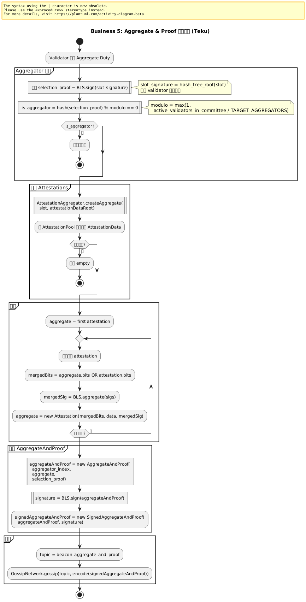
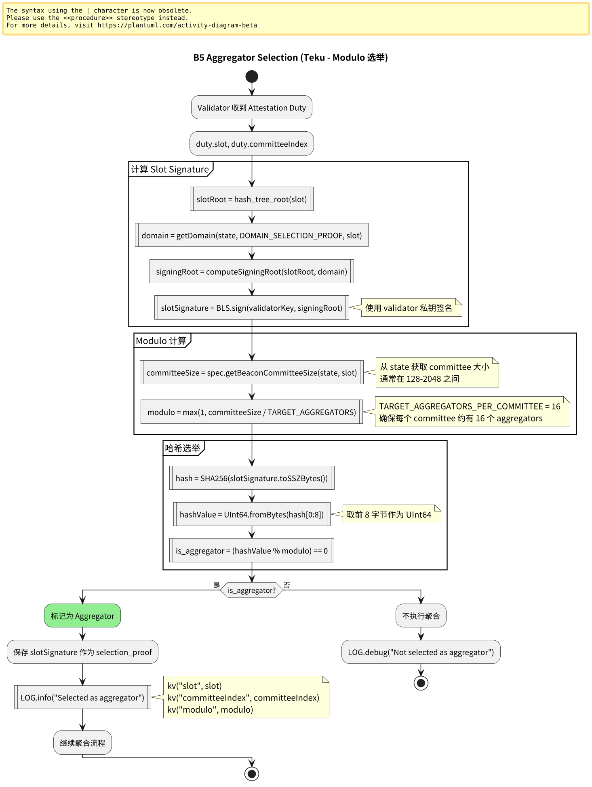
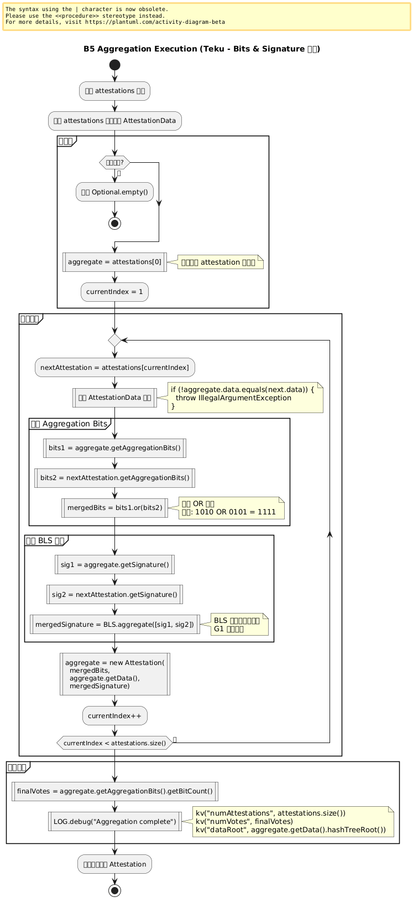
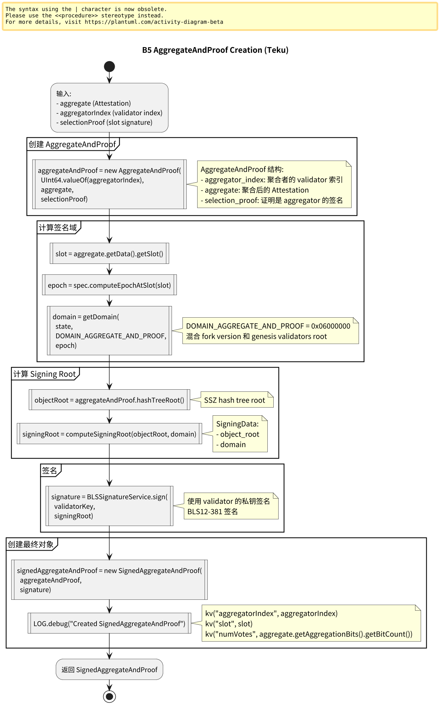
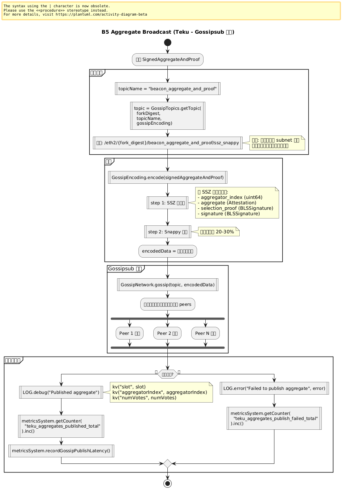

# 附录：业务 5 – Aggregate & Proof 聚合投票

本页展示 Teku 中 Aggregate Attestation 的完整流程，包括聚合器选举、聚合过程和广播。

> **Teku 特点**：基于 modulo 选举，使用 AttestationPool 管理，BLS 签名聚合。

---

## 业务 5：Aggregate & Proof 聚合投票

### 主流程



子流程跳转：

- [Aggregator 选举流程](#b5-aggregator-selection)
- [Attestation 收集流程](#b5-attestation-collection)
- [聚合执行流程](#b5-aggregation-execution)
- [AggregateAndProof 创建流程](#b5-aggregate-proof-creation)
- [聚合广播流程](#b5-aggregate-broadcast)

---

## B5 Aggregator Selection（Aggregator 选举） {#b5-aggregator-selection}



**关键组件**：
- `AggregatorUtil`: 聚合器工具类
- `ValidatorDuties`: Validator 职责管理

**Teku 特点**：
```java
public class AggregatorUtil {
  private static final int TARGET_AGGREGATORS_PER_COMMITTEE = 16;
  
  public static boolean isAggregator(
      BeaconState state,
      UInt64 slot,
      int committeeIndex,
      BLSSignature slotSignature) {
    
    // 1. 计算 committee 大小
    int committeeSize = spec.getBeaconCommitteeSize(state, slot);
    
    // 2. 计算 modulo
    int modulo = Math.max(1, 
      committeeSize / TARGET_AGGREGATORS_PER_COMMITTEE
    );
    
    // 3. 哈希选举
    Bytes32 hash = Hash.sha256(slotSignature.toSSZBytes());
    UInt64 hashValue = UInt64.fromBytes(hash.slice(0, 8));
    
    return hashValue.mod(modulo).equals(UInt64.ZERO);
  }
  
  public SafeFuture<BLSSignature> getSlotSignature(
      UInt64 slot,
      BLSKeyPair validatorKey) {
    
    // 签名 slot
    Bytes slotRoot = spec.computeSigningRoot(
      SSZ.encode(slot),
      getDomain(state, DOMAIN_SELECTION_PROOF, slot)
    );
    
    return SafeFuture.completedFuture(
      BLS.sign(validatorKey.getSecretKey(), slotRoot)
    );
  }
}
```

---

## B5 Attestation Collection（Attestation 收集） {#b5-attestation-collection}


**关键组件**：
- `AttestationPool`: Attestation 池管理
- `MatchingDataAttestationGroup`: 相同 Data 分组

**Teku 特点**：
```java
public class AttestationPool {
  // 按 slot 和 attestationDataRoot 索引
  private final Map<UInt64, Map<Bytes32, MatchingDataAttestationGroup>> 
    attestationsBySlot = new ConcurrentHashMap<>();
  
  public List<Attestation> getAttestationsForAggregation(
      UInt64 slot,
      Bytes32 attestationDataRoot) {
    
    Map<Bytes32, MatchingDataAttestationGroup> slotAttestations = 
      attestationsBySlot.get(slot);
    
    if (slotAttestations == null) {
      return Collections.emptyList();
    }
    
    MatchingDataAttestationGroup group = 
      slotAttestations.get(attestationDataRoot);
    
    if (group == null) {
      return Collections.emptyList();
    }
    
    // 返回该组的所有 attestations
    return group.getAttestations();
  }
}

public class MatchingDataAttestationGroup {
  private final AttestationData data;
  private final List<Attestation> attestations = 
    new CopyOnWriteArrayList<>();
  
  public void add(Attestation attestation) {
    // 验证 data 匹配
    if (!attestation.getData().equals(data)) {
      throw new IllegalArgumentException("Data mismatch");
    }
    
    // 去重检查（避免重复添加相同的 attestation）
    if (!isDuplicate(attestation)) {
      attestations.add(attestation);
    }
  }
  
  private boolean isDuplicate(Attestation newAttestation) {
    for (Attestation existing : attestations) {
      if (existing.getAggregationBits().equals(
          newAttestation.getAggregationBits())) {
        return true;
      }
    }
    return false;
  }
}
```

---

## B5 Aggregation Execution（聚合执行） {#b5-aggregation-execution}



**关键组件**：
- `AttestationAggregator`: 聚合器
- `BLS`: BLS 签名库

**Teku 特点**：
```java
public class AttestationAggregator {
  public SafeFuture<Optional<Attestation>> createAggregate(
      UInt64 slot,
      Bytes32 attestationDataRoot) {
    
    return SafeFuture.of(() -> {
      // 1. 收集 attestations
      List<Attestation> attestations = 
        attestationPool.getAttestationsForAggregation(
          slot, attestationDataRoot
        );
      
      if (attestations.isEmpty()) {
        LOG.debug("No attestations to aggregate",
          kv("slot", slot)
        );
        return Optional.empty();
      }
      
      // 2. 聚合
      Attestation result = attestations.get(0);
      for (int i = 1; i < attestations.size(); i++) {
        result = aggregate(result, attestations.get(i));
      }
      
      LOG.debug("Created aggregate attestation",
        kv("slot", slot),
        kv("numAttestations", attestations.size()),
        kv("numVotes", result.getAggregationBits().getBitCount())
      );
      
      return Optional.of(result);
    });
  }
  
  private Attestation aggregate(Attestation a1, Attestation a2) {
    // 验证 AttestationData 相同
    if (!a1.getData().equals(a2.getData())) {
      throw new IllegalArgumentException(
        "Cannot aggregate attestations with different data"
      );
    }
    
    // 聚合 aggregation bits (按位 OR)
    Bitlist mergedBits = a1.getAggregationBits()
      .or(a2.getAggregationBits());
    
    // 聚合 BLS 签名
    BLSSignature mergedSignature = BLS.aggregate(
      List.of(a1.getSignature(), a2.getSignature())
    );
    
    return new Attestation(
      mergedBits,
      a1.getData(),
      mergedSignature
    );
  }
}
```

---

## B5 AggregateAndProof Creation（AggregateAndProof 创建） {#b5-aggregate-proof-creation}



**关键组件**：
- `AggregateAttestationService`: 聚合服务
- `BLSSignatureService`: 签名服务

**Teku 特点**：
```java
public class AggregateAttestationService {
  public SafeFuture<Optional<SignedAggregateAndProof>> produceAggregate(
      UInt64 slot,
      int committeeIndex,
      Bytes32 attestationDataRoot,
      int validatorIndex,
      BLSSignature selectionProof) {
    
    return attestationAggregator
      .createAggregate(slot, attestationDataRoot)
      .thenCompose(aggregateOpt -> {
        if (aggregateOpt.isEmpty()) {
          return SafeFuture.completedFuture(Optional.empty());
        }
        
        Attestation aggregate = aggregateOpt.get();
        
        // 创建 AggregateAndProof
        AggregateAndProof aggregateAndProof = new AggregateAndProof(
          UInt64.valueOf(validatorIndex),
          aggregate,
          selectionProof
        );
        
        // 签名 AggregateAndProof
        return signAggregateAndProof(aggregateAndProof, slot)
          .thenApply(signature -> 
            Optional.of(new SignedAggregateAndProof(
              aggregateAndProof,
              signature
            ))
          );
      });
  }
  
  private SafeFuture<BLSSignature> signAggregateAndProof(
      AggregateAndProof aggregateAndProof,
      UInt64 slot) {
    
    Bytes signingRoot = spec.computeSigningRoot(
      aggregateAndProof,
      getDomain(DOMAIN_AGGREGATE_AND_PROOF, slot)
    );
    
    return signatureService.sign(signingRoot);
  }
}
```

---

## B5 Aggregate Broadcast（聚合广播） {#b5-aggregate-broadcast}



**关键组件**：
- `AggregateGossipManager`: 聚合 Gossip 管理
- `GossipNetwork`: Gossipsub 网络

**Teku 特点**：
```java
public class AggregateGossipManager {
  private static final String AGGREGATE_TOPIC = 
    "beacon_aggregate_and_proof";
  
  public SafeFuture<Void> publishAggregate(
      SignedAggregateAndProof signedAggregate) {
    
    // 获取主题
    String topic = GossipTopics.getTopic(
      forkDigest,
      AGGREGATE_TOPIC,
      gossipEncoding
    );
    // /eth2/{fork_digest}/beacon_aggregate_and_proof/ssz_snappy
    
    // 编码
    Bytes encodedData = gossipEncoding.encode(signedAggregate);
    
    // 广播
    return gossipNetwork.gossip(topic, encodedData)
      .thenAccept(__ -> {
        LOG.debug("Published aggregate",
          kv("slot", signedAggregate.getMessage()
            .getAggregate().getData().getSlot()),
          kv("aggregatorIndex", signedAggregate.getMessage()
            .getAggregatorIndex()),
          kv("numVotes", signedAggregate.getMessage()
            .getAggregate().getAggregationBits().getBitCount())
        );
        
        // 更新 metrics
        metricsSystem.getCounter(
          "teku_aggregates_published_total"
        ).inc();
      })
      .exceptionally(error -> {
        LOG.error("Failed to publish aggregate", error);
        return null;
      });
  }
}
```

---

## 与 Prysm 对比

| 维度 | Prysm | Teku |
|------|-------|------|
| **选举算法** | isAggregator() | AggregatorUtil.isAggregator() |
| **Modulo** | TARGET_AGGREGATORS_PER_COMMITTEE | 同样 (16) |
| **池管理** | AttestationPool (map) | MatchingDataAttestationGroup |
| **聚合** | AggregateAttestations() | AttestationAggregator |
| **签名** | Sign(AggregateAndProof) | BLSSignatureService |
| **广播** | PublishAggregate() | AggregateGossipManager |

---

## 流程图源文件

PlantUML 源文件位于：
- `img/teku/business5_aggregate_flow.puml` - 主流程
- `img/teku/business5_aggregator_selection.puml` - 选举子流程
- `img/teku/business5_attestation_collection.puml` - 收集子流程
- `img/teku/business5_aggregation_execution.puml` - 聚合子流程
- `img/teku/business5_aggregate_proof_creation.puml` - 创建子流程
- `img/teku/business5_aggregate_broadcast.puml` - 广播子流程

---

**最后更新**: 2026-01-14  
**参考章节**: [第 14 章：消息验证流程](./chapter_14_message_validation.md)
