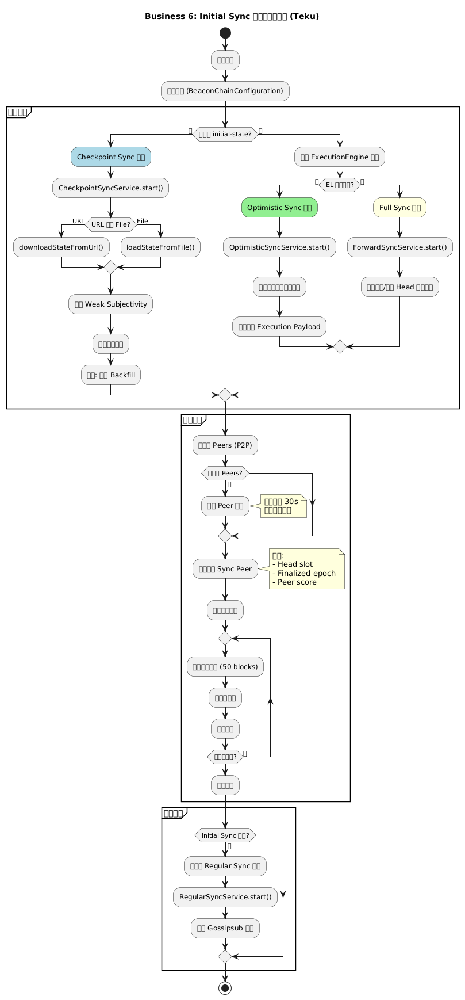
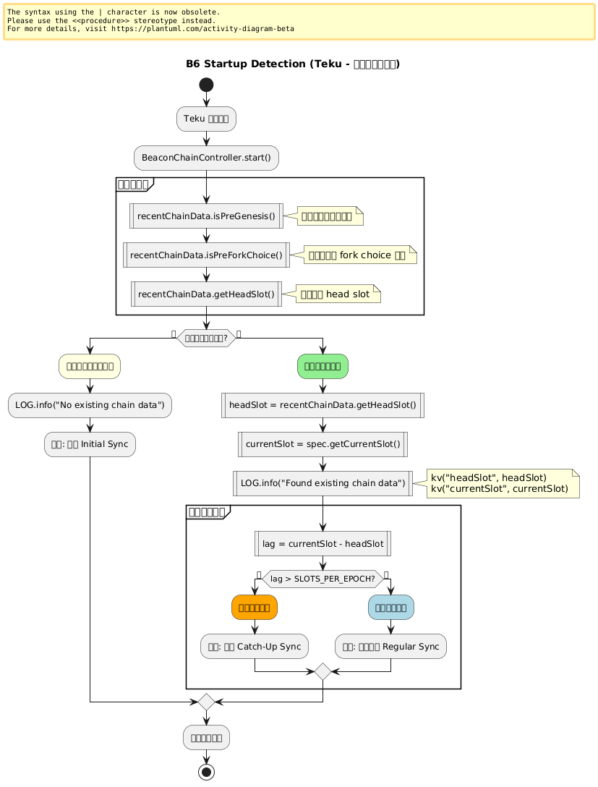
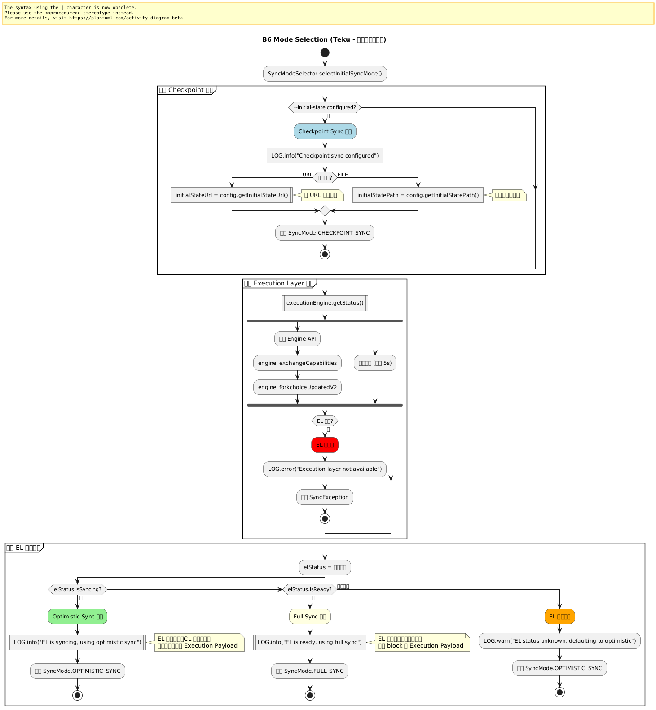
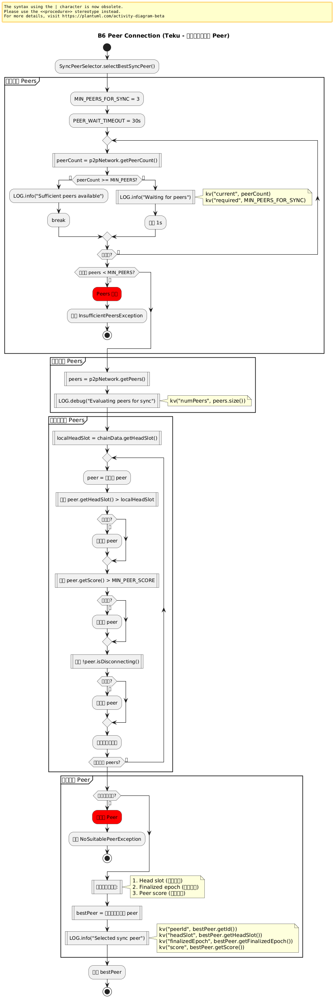
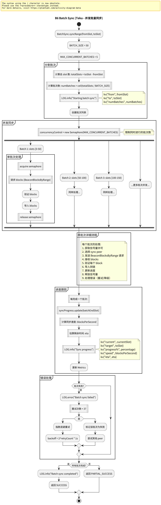
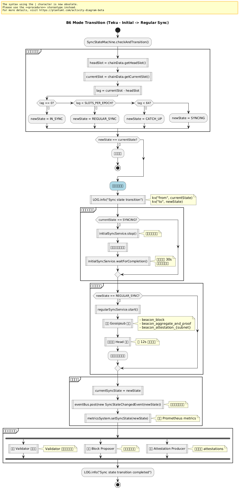

# 附录：业务 6 – Initial Sync 启动与模式选择

本页展示 Teku 节点启动时如何选择合适的 Initial Sync 模式（Full Sync / Checkpoint Sync / Optimistic Sync）。

> **Teku 特点**：配置驱动决策，支持多模式自动选择，异步批量同步。

---

## 业务 6：Initial Sync 启动与模式选择

### 主流程



子流程跳转：

- [启动检测流程](#b6-startup-detection)
- [模式选择流程](#b6-mode-selection)
- [Peer 连接流程](#b6-peer-connection)
- [批量同步流程](#b6-batch-sync)
- [模式切换流程](#b6-mode-transition)

---

## B6 Startup Detection（启动检测） {#b6-startup-detection}



**关键组件**：
- `BeaconChainController`: 链控制器
- `RecentChainData`: 链数据管理
- `SyncService`: 同步服务

**Teku 特点**：
```java
public class BeaconChainController {
  public SafeFuture<Void> start() {
    return SafeFuture.of(() -> {
      // 1. 检查是否有已存储的链数据
      boolean hasChainData = recentChainData.isPreGenesis() || 
                            recentChainData.isPreForkChoice();
      
      if (!hasChainData) {
        LOG.info("No existing chain data, starting initial sync");
        return syncService.startInitialSync();
      } else {
        LOG.info("Found existing chain data",
          kv("headSlot", recentChainData.getHeadSlot())
        );
        
        // 检查是否需要同步
        if (isBehind()) {
          return syncService.startCatchUp();
        } else {
          return syncService.startRegularSync();
        }
      }
    });
  }
  
  private boolean isBehind() {
    UInt64 headSlot = recentChainData.getHeadSlot();
    UInt64 currentSlot = recentChainData.getCurrentSlot();
    return currentSlot.minus(headSlot)
      .isGreaterThan(UInt64.valueOf(SLOTS_PER_EPOCH));
  }
}
```

---

## B6 Mode Selection（模式选择） {#b6-mode-selection}



**关键组件**：
- `SyncModeSelector`: 同步模式选择器
- `BeaconChainConfiguration`: 配置管理

**Teku 特点**：
```java
public class SyncModeSelector {
  public SafeFuture<SyncMode> selectInitialSyncMode() {
    return SafeFuture.of(() -> {
      // 优先级 1: Checkpoint Sync
      if (config.getInitialStateUrl().isPresent() || 
          config.getInitialStatePath().isPresent()) {
        LOG.info("Checkpoint sync configured");
        return SyncMode.CHECKPOINT_SYNC;
      }
      
      // 优先级 2: 检查 Execution Layer 状态
      return checkExecutionLayerStatus()
        .thenApply(elStatus -> {
          if (elStatus.isSyncing()) {
            // EL 正在同步，使用 Optimistic Sync
            LOG.info("EL is syncing, using optimistic sync");
            return SyncMode.OPTIMISTIC_SYNC;
          } else if (elStatus.isReady()) {
            // EL 已就绪，使用 Full Sync
            LOG.info("EL is ready, using full sync");
            return SyncMode.FULL_SYNC;
          } else {
            // EL 不可用，等待或报错
            LOG.warn("EL is not available");
            throw new SyncException("Execution layer not available");
          }
        });
    });
  }
  
  private SafeFuture<ExecutionLayerStatus> checkExecutionLayerStatus() {
    return executionEngine.getStatus()
      .exceptionally(error -> {
        LOG.error("Failed to get EL status", error);
        return ExecutionLayerStatus.unavailable();
      });
  }
}
```

---

## B6 Peer Connection（Peer 连接） {#b6-peer-connection}



**关键组件**：
- `P2PNetwork`: P2P 网络管理
- `PeerManager`: Peer 管理器
- `SyncPeerSelector`: 同步 Peer 选择器

**Teku 特点**：
```java
public class SyncPeerSelector {
  private static final int MIN_PEERS_FOR_SYNC = 3;
  private static final Duration PEER_WAIT_TIMEOUT = Duration.ofSeconds(30);
  
  public SafeFuture<Peer> selectBestSyncPeer() {
    return waitForSufficientPeers()
      .thenCompose(__ -> findBestPeer());
  }
  
  private SafeFuture<Void> waitForSufficientPeers() {
    return asyncRunner.runWithRetry(() -> {
      int peerCount = p2pNetwork.getPeerCount();
      if (peerCount >= MIN_PEERS_FOR_SYNC) {
        return SafeFuture.COMPLETE;
      }
      
      LOG.info("Waiting for peers",
        kv("current", peerCount),
        kv("required", MIN_PEERS_FOR_SYNC)
      );
      
      return SafeFuture.failedFuture(
        new InsufficientPeersException("Not enough peers")
      );
    }, PEER_WAIT_TIMEOUT);
  }
  
  private SafeFuture<Peer> findBestPeer() {
    List<Peer> peers = p2pNetwork.getPeers();
    
    // 按以下标准排序:
    // 1. Head slot (越新越好)
    // 2. Finalized epoch (越新越好)
    // 3. Peer score (越高越好)
    return SafeFuture.completedFuture(
      peers.stream()
        .filter(this::isSuitableForSync)
        .max(Comparator
          .comparing(Peer::getHeadSlot)
          .thenComparing(Peer::getFinalizedEpoch)
          .thenComparing(Peer::getScore)
        )
        .orElseThrow(() -> 
          new NoSuitablePeerException("No suitable sync peer found")
        )
    );
  }
  
  private boolean isSuitableForSync(Peer peer) {
    return peer.getHeadSlot().isGreaterThan(localHeadSlot) &&
           peer.getScore() > MIN_PEER_SCORE &&
           !peer.isDisconnecting();
  }
}
```

---

## B6 Batch Sync（批量同步） {#b6-batch-sync}



**关键组件**：
- `ForwardSyncService`: 前向同步服务
- `BatchSync`: 批量同步管理器
- `BlockImporter`: 区块导入器

**Teku 特点**：
```java
public class BatchSync {
  private static final int BATCH_SIZE = 50;
  private static final int MAX_CONCURRENT_BATCHES = 5;
  
  private final Semaphore concurrencyControl = 
    new Semaphore(MAX_CONCURRENT_BATCHES);
  
  public SafeFuture<Void> syncRange(UInt64 fromSlot, UInt64 toSlot) {
    LOG.info("Starting batch sync",
      kv("from", fromSlot),
      kv("to", toSlot)
    );
    
    List<SafeFuture<Void>> batchFutures = new ArrayList<>();
    
    UInt64 currentStart = fromSlot;
    while (currentStart.isLessThan(toSlot)) {
      UInt64 batchEnd = currentStart.plus(BATCH_SIZE).min(toSlot);
      
      SafeFuture<Void> batchFuture = 
        syncBatch(currentStart, batchEnd);
      batchFutures.add(batchFuture);
      
      currentStart = batchEnd;
    }
    
    return SafeFuture.allOf(batchFutures.toArray(new SafeFuture[0]));
  }
  
  private SafeFuture<Void> syncBatch(UInt64 startSlot, UInt64 endSlot) {
    return SafeFuture.of(() -> {
      concurrencyControl.acquire();
      return null;
    })
    .thenCompose(__ -> requestBlocks(startSlot, endSlot))
    .thenCompose(blocks -> importBlocks(blocks))
    .whenComplete((result, error) -> {
      concurrencyControl.release();
      
      if (error != null) {
        LOG.error("Batch sync failed",
          kv("start", startSlot),
          kv("end", endSlot),
          error
        );
      } else {
        updateProgress(endSlot);
      }
    });
  }
  
  private SafeFuture<List<SignedBeaconBlock>> requestBlocks(
      UInt64 startSlot,
      UInt64 endSlot) {
    
    return peerSelector.selectBestSyncPeer()
      .thenCompose(peer -> 
        peer.requestBlocksByRange(startSlot, endSlot.minus(startSlot))
      );
  }
}
```

---

## B6 Mode Transition（模式切换） {#b6-mode-transition}



**关键组件**：
- `SyncStateMachine`: 同步状态机
- `SyncService`: 同步服务管理

**Teku 特点**：
```java
public class SyncStateMachine {
  public void checkAndTransition() {
    SyncState currentState = getCurrentState();
    SyncState newState = calculateNewState();
    
    if (currentState != newState) {
      LOG.info("Sync state transition",
        kv("from", currentState),
        kv("to", newState)
      );
      
      transitionTo(newState);
    }
  }
  
  private void transitionTo(SyncState newState) {
    switch (newState) {
      case REGULAR_SYNC:
        transitionToRegularSync();
        break;
      case CATCH_UP:
        transitionToCatchUp();
        break;
      case IN_SYNC:
        transitionToInSync();
        break;
    }
  }
  
  private void transitionToRegularSync() {
    // 1. 停止 Initial Sync 服务
    initialSyncService.stop();
    
    // 2. 等待当前批次完成
    initialSyncService.waitForCompletion()
      .thenRun(() -> {
        // 3. 启动 Regular Sync
        regularSyncService.start();
        
        // 4. 订阅 Gossipsub 主题
        gossipNetwork.subscribeToAllTopics();
        
        // 5. 更新状态
        currentSyncState = SyncState.REGULAR_SYNC;
        
        // 6. 发布事件
        eventBus.post(new SyncStateChangedEvent(
          SyncState.REGULAR_SYNC
        ));
      });
  }
}
```

---

## 与 Prysm 对比

| 维度 | Prysm | Teku |
|------|-------|------|
| **启动检测** | InitialSync() | BeaconChainController.start() |
| **模式选择** | 自动检测 | SyncModeSelector |
| **Checkpoint** | --checkpoint-sync-url | --initial-state |
| **Peer 等待** | 30s 超时 | 同样 30s |
| **批量大小** | 64 blocks | 50 blocks |
| **并发控制** | Context | Semaphore |
| **模式切换** | 函数调用 | SyncStateMachine |

---

## 流程图源文件

PlantUML 源文件位于：
- `img/teku/business6_initial_sync_flow.puml` - 主流程
- `img/teku/business6_startup_detection.puml` - 启动检测
- `img/teku/business6_mode_selection.puml` - 模式选择
- `img/teku/business6_peer_connection.puml` - Peer 连接
- `img/teku/business6_batch_sync.puml` - 批量同步
- `img/teku/business6_mode_transition.puml` - 模式切换

---

**最后更新**: 2026-01-14  
**参考章节**: [第 18-20 章：Initial Sync 实现](./chapter_18_full_sync.md)
