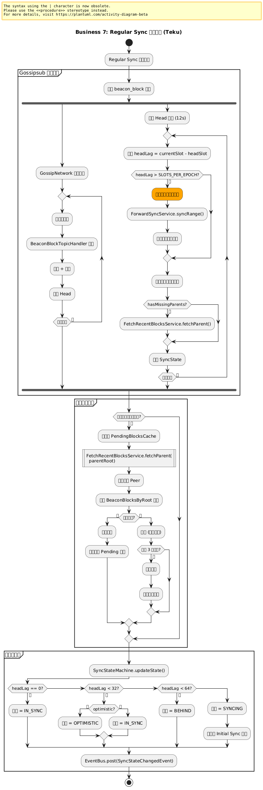
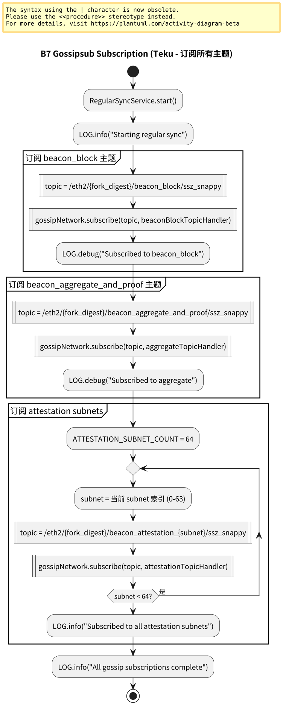
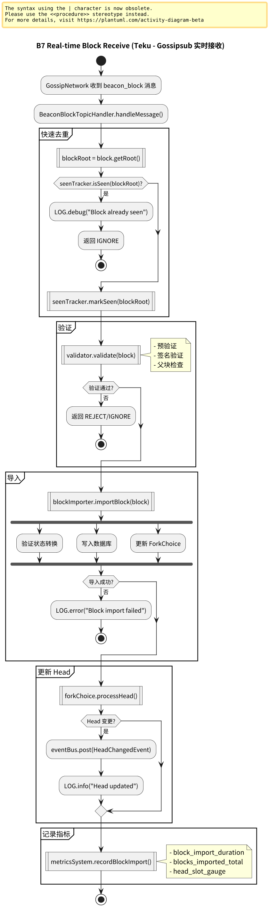
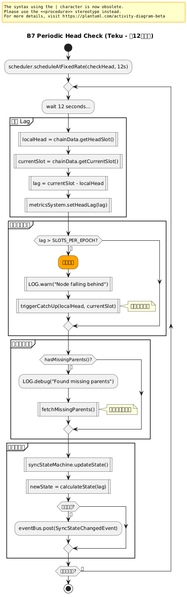
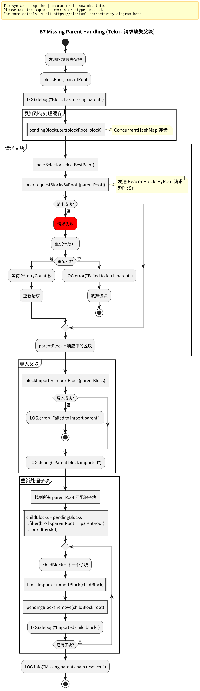
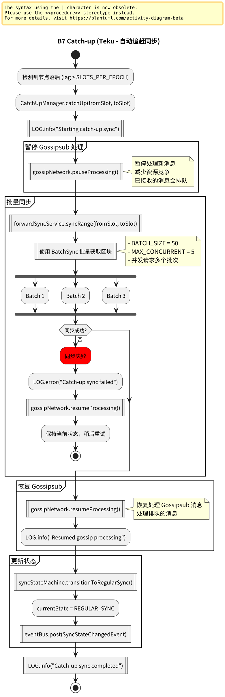
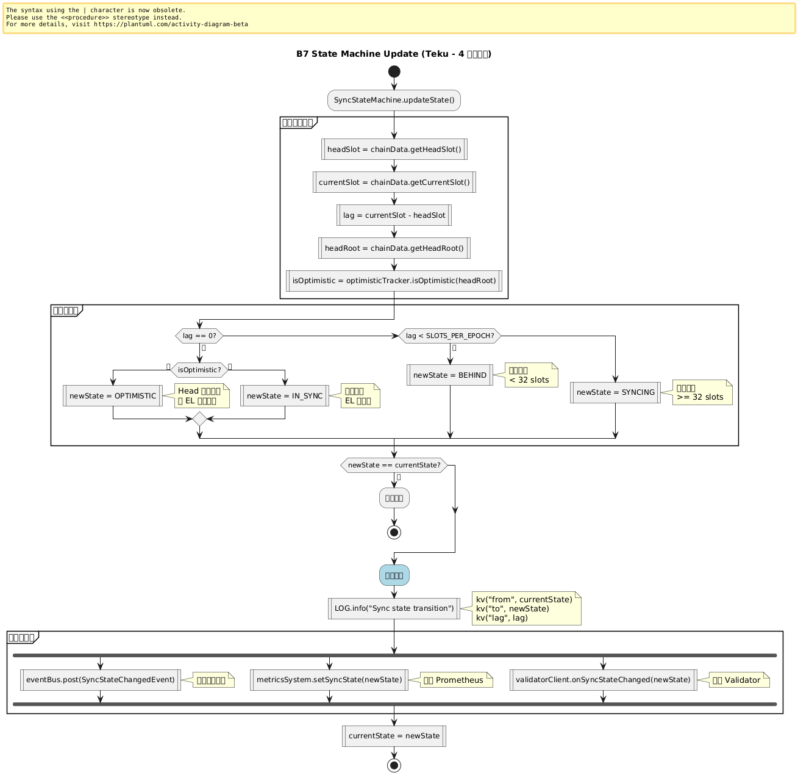

# 附录：业务 7 – Regular Sync 日常同步

本页展示 Teku 完成 Initial Sync 后的日常同步流程，包括实时跟踪、父块请求和追赶机制。

> **Teku 特点**：Gossipsub 实时接收，定期 Head 检查，自动追赶，状态机管理。

---

## 业务 7：Regular Sync 日常同步

### 主流程



子流程跳转：

- [Gossipsub 订阅流程](#b7-gossipsub-subscription)
- [实时区块接收流程](#b7-real-time-block-receive)
- [定期 Head 检查流程](#b7-periodic-head-check)
- [缺失父块处理流程](#b7-missing-parent-handling)
- [自动追赶流程](#b7-catch-up)
- [状态机更新流程](#b7-state-machine-update)

---

## B7 Gossipsub Subscription（Gossipsub 订阅） {#b7-gossipsub-subscription}



**关键组件**：
- `GossipNetwork`: Gossipsub 网络管理
- `TopicSubscriptionManager`: 主题订阅管理器

**Teku 特点**：
```java
public class RegularSyncService {
  public void start() {
    LOG.info("Starting regular sync");
    
    // 订阅所有必要的 Gossipsub 主题
    subscribeToGossipTopics();
    
    // 启动定期任务
    startPeriodicTasks();
  }
  
  private void subscribeToGossipTopics() {
    // 1. 订阅 beacon_block 主题
    gossipNetwork.subscribe(
      GossipTopics.BEACON_BLOCK,
      beaconBlockTopicHandler
    );
    
    // 2. 订阅 beacon_aggregate_and_proof 主题
    gossipNetwork.subscribe(
      GossipTopics.BEACON_AGGREGATE_AND_PROOF,
      aggregateAttestationTopicHandler
    );
    
    // 3. 订阅 attestation subnets（动态订阅）
    for (int subnet = 0; subnet < ATTESTATION_SUBNET_COUNT; subnet++) {
      subscribeToAttestationSubnet(subnet);
    }
    
    LOG.info("Subscribed to all gossip topics");
  }
  
  private void subscribeToAttestationSubnet(int subnet) {
    String topic = GossipTopics.getAttestationSubnetTopic(
      forkDigest, subnet
    );
    
    gossipNetwork.subscribe(topic, attestationTopicHandler);
  }
}
```

---

## B7 Real-time Block Receive（实时区块接收） {#b7-real-time-block-receive}



**关键组件**：
- `BeaconBlockTopicHandler`: 区块主题处理器
- `BlockImporter`: 区块导入器

**Teku 特点**：
```java
public class BeaconBlockTopicHandler {
  private SafeFuture<Void> onBeaconBlock(SignedBeaconBlock block) {
    LOG.debug("Received gossip block",
      kv("slot", block.getSlot()),
      kv("root", block.getRoot())
    );
    
    return SafeFuture.of(() -> {
      // 1. 快速去重检查
      if (seenTracker.isSeen(block.getRoot())) {
        return InternalValidationResult.IGNORE;
      }
      
      // 2. 标记为已见
      seenTracker.markSeen(block.getRoot());
      
      return block;
    })
    .thenCompose(b -> validator.validate(b))
    .thenCompose(validationResult -> {
      if (validationResult.isAccept()) {
        // 3. 导入区块
        return blockImporter.importBlock(block);
      } else {
        return SafeFuture.completedFuture(validationResult);
      }
    })
    .thenAccept(result -> {
      if (result.isSuccessful()) {
        // 4. 更新 Head
        forkChoice.processHead();
        
        // 5. 记录指标
        metricsSystem.recordBlockImport(block);
      } else {
        handleImportFailure(block, result);
      }
    });
  }
}
```

---

## B7 Periodic Head Check（定期 Head 检查） {#b7-periodic-head-check}



**关键组件**：
- `HeadTracker`: Head 追踪器
- `ScheduledExecutorService`: 定时任务执行器

**Teku 特点**：
```java
public class HeadTracker {
  private static final Duration HEAD_CHECK_INTERVAL = 
    Duration.ofSeconds(12);
  
  public void startTracking() {
    scheduler.scheduleAtFixedRate(
      this::checkHead,
      0,
      HEAD_CHECK_INTERVAL.getSeconds(),
      TimeUnit.SECONDS
    );
  }
  
  private void checkHead() {
    UInt64 localHead = chainData.getHeadSlot();
    UInt64 currentSlot = chainData.getCurrentSlot();
    UInt64 lag = currentSlot.minus(localHead);
    
    // 更新 metrics
    metricsSystem.setHeadLag(lag);
    
    // 检查是否落后
    if (isFallingBehind(lag)) {
      LOG.warn("Node falling behind",
        kv("localHead", localHead),
        kv("currentSlot", currentSlot),
        kv("lag", lag)
      );
      
      // 触发追赶
      triggerCatchUp(localHead, currentSlot);
    }
    
    // 检查是否有缺失父块
    if (hasMissingParents()) {
      LOG.debug("Found blocks with missing parents");
      fetchMissingParents();
    }
    
    // 更新同步状态
    syncStateMachine.updateState();
  }
  
  private boolean isFallingBehind(UInt64 lag) {
    return lag.isGreaterThan(UInt64.valueOf(SLOTS_PER_EPOCH));
  }
  
  private void triggerCatchUp(UInt64 from, UInt64 to) {
    // 切换到批量同步模式
    forwardSyncService.syncRange(from, to);
  }
}
```

---

## B7 Missing Parent Handling（缺失父块处理） {#b7-missing-parent-handling}



**关键组件**：
- `PendingBlocksCache`: 待处理区块缓存
- `FetchRecentBlocksService`: 父块获取服务

**Teku 特点**：
```java
public class MissingParentHandler {
  private final Map<Bytes32, SignedBeaconBlock> pendingBlocks = 
    new ConcurrentHashMap<>();
  
  public SafeFuture<BlockImportResult> handleMissingParent(
      SignedBeaconBlock block) {
    
    Bytes32 parentRoot = block.getParentRoot();
    
    LOG.debug("Block has missing parent",
      kv("blockRoot", block.getRoot()),
      kv("parentRoot", parentRoot),
      kv("slot", block.getSlot())
    );
    
    // 1. 添加到待处理缓存
    pendingBlocks.put(block.getRoot(), block);
    
    // 2. 请求父块
    return fetchParentBlock(parentRoot)
      .thenCompose(parent -> {
        // 3. 导入父块
        return blockImporter.importBlock(parent);
      })
      .thenCompose(result -> {
        if (result.isSuccessful()) {
          // 4. 重新处理待处理的子块
          return processChildBlocks(parentRoot);
        } else {
          return SafeFuture.completedFuture(result);
        }
      })
      .exceptionally(error -> {
        LOG.error("Failed to fetch missing parent", error);
        return BlockImportResult.failed("Parent fetch failed");
      });
  }
  
  private SafeFuture<SignedBeaconBlock> fetchParentBlock(
      Bytes32 parentRoot) {
    
    return peerSelector.selectBestPeer()
      .thenCompose(peer -> 
        peer.requestBlocksByRoot(List.of(parentRoot))
      )
      .thenApply(blocks -> {
        if (blocks.isEmpty()) {
          throw new BlockNotFoundException(
            "Parent block not found: " + parentRoot
          );
        }
        return blocks.get(0);
      })
      .orTimeout(5, TimeUnit.SECONDS);
  }
  
  private SafeFuture<BlockImportResult> processChildBlocks(
      Bytes32 parentRoot) {
    
    // 找到所有以 parentRoot 为父块的待处理块
    List<SignedBeaconBlock> childBlocks = pendingBlocks.values()
      .stream()
      .filter(b -> b.getParentRoot().equals(parentRoot))
      .sorted(Comparator.comparing(SignedBeaconBlock::getSlot))
      .collect(Collectors.toList());
    
    // 按顺序导入
    SafeFuture<BlockImportResult> chain = 
      SafeFuture.completedFuture(BlockImportResult.successful());
    
    for (SignedBeaconBlock child : childBlocks) {
      chain = chain.thenCompose(__ -> 
        blockImporter.importBlock(child)
      );
      
      // 从待处理缓存中移除
      pendingBlocks.remove(child.getRoot());
    }
    
    return chain;
  }
}
```

---

## B7 Catch-up（自动追赶） {#b7-catch-up}



**关键组件**：
- `ForwardSyncService`: 前向同步服务
- `BatchSync`: 批量同步

**Teku 特点**：
```java
public class CatchUpManager {
  public SafeFuture<Void> catchUp(UInt64 fromSlot, UInt64 toSlot) {
    LOG.info("Starting catch-up sync",
      kv("from", fromSlot),
      kv("to", toSlot)
    );
    
    // 暂停 Gossipsub 处理（减少资源竞争）
    gossipNetwork.pauseProcessing();
    
    return forwardSyncService.syncRange(fromSlot, toSlot)
      .thenAccept(__ -> {
        LOG.info("Catch-up sync completed");
        
        // 恢复 Gossipsub 处理
        gossipNetwork.resumeProcessing();
        
        // 更新状态
        syncStateMachine.transitionToRegularSync();
      })
      .exceptionally(error -> {
        LOG.error("Catch-up sync failed", error);
        gossipNetwork.resumeProcessing();
        return null;
      });
  }
}
```

---

## B7 State Machine Update（状态机更新） {#b7-state-machine-update}



**关键组件**：
- `SyncStateMachine`: 同步状态机

**Teku 特点**：
```java
public class SyncStateMachine {
  public enum State {
    SYNCING,      // 正在大量同步
    IN_SYNC,      // 完全同步
    OPTIMISTIC,   // 乐观同步（EL 未验证）
    BEHIND        // 轻微落后
  }
  
  private volatile State currentState = State.SYNCING;
  
  public void updateState() {
    State newState = calculateState();
    
    if (newState != currentState) {
      LOG.info("Sync state transition",
        kv("from", currentState),
        kv("to", newState)
      );
      
      currentState = newState;
      notifyListeners(newState);
    }
  }
  
  private State calculateState() {
    UInt64 headSlot = chainData.getHeadSlot();
    UInt64 currentSlot = chainData.getCurrentSlot();
    UInt64 lag = currentSlot.minus(headSlot);
    
    // 完全同步
    if (lag.isZero()) {
      // 检查是否 optimistic
      if (optimisticTracker.isOptimistic(chainData.getHeadRoot())) {
        return State.OPTIMISTIC;
      }
      return State.IN_SYNC;
    }
    
    // 轻微落后（1 epoch 内）
    if (lag.isLessThan(UInt64.valueOf(SLOTS_PER_EPOCH))) {
      return State.BEHIND;
    }
    
    // 严重落后
    return State.SYNCING;
  }
  
  private void notifyListeners(State newState) {
    eventBus.post(new SyncStateChangedEvent(newState));
    metricsSystem.setSyncState(newState);
  }
}
```

---

## 与 Prysm 对比

| 维度 | Prysm | Teku |
|------|-------|------|
| **订阅** | SubscribeToBlocks() | GossipNetwork.subscribe() |
| **Head 检查** | 12s 定时器 | ScheduledExecutorService |
| **缺失父块** | pendingBlocksQueue | PendingBlocksCache |
| **追赶** | 自动触发 | ForwardSyncService |
| **状态机** | 4 状态 | 4 状态（同样） |
| **事件** | Channel | EventBus |

---

## 流程图源文件

PlantUML 源文件位于：
- `img/teku/business7_regular_sync_flow.puml` - 主流程
- `img/teku/business7_gossipsub_subscription.puml` - Gossipsub 订阅
- `img/teku/business7_real_time_block_receive.puml` - 实时区块接收
- `img/teku/business7_periodic_head_check.puml` - 定期 Head 检查
- `img/teku/business7_missing_parent_handling.puml` - 缺失父块处理
- `img/teku/business7_catch_up.puml` - 自动追赶
- `img/teku/business7_state_machine_update.puml` - 状态机更新

---

**最后更新**: 2026-01-14  
**参考章节**: [第 21 章：Regular Sync 概述](./chapter_21_regular_sync.md)
